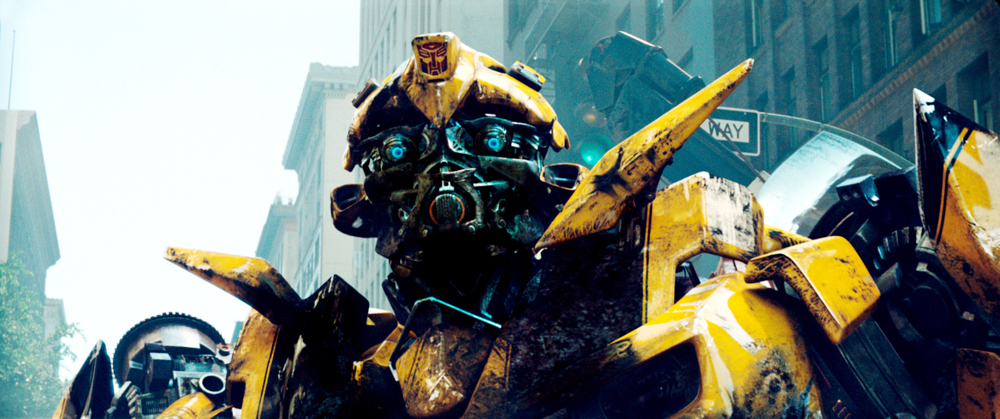

* * *

 

Míralo de este modo, cuando ves una película que tiene efectos asombrosamente reales, no te preocupas por pensar de que forma los hicieron, tal vez ni siquiera lográs ver los errores que estan a simple vista. Debido a que no tienes el conocimiento necesario para hacerlo, **tan sencillo como eso**. Por tanto, disfrutas los efectos, la película, sin cuestionar nada de lo que te estan vendiendo, **porque no tienes idea de como hacerlo** siquiera.

# _El conocimiento es un arma de doble filo_ _y depende de ti la decisión de cual lado afilar._

Siempre, pero siempre, dejarás de disfrutar las cosas como lo hacías antes al momento de entender como funcionan, para bien o para mal, porque ahora tendrás la capacidad de ver detalles y errores que antes no veías. Si eres escritor, si sabes sobre los tiempos que debe llevar una historia para que tenga sentido, notaras errores de guión fatales en las películas, e inevitablemente eso **no te dejará disfrutar de la misma forma que antes**.

Por otro lado, el conocimiento y entendimiento le dará sabor a cosas que nunca antes podías saborear, continuando con los ejemplos de películas, si eres diseñador 3D, actor o simplemente comienzas a crear tus propias producciones, notaras la calidad de ciertas tomas que antes dabas por sentadas, notaras lo difícil que fue crearlas y la complejidad detrás de un simple rayo de luz, de una lágrima o de una explosión que destruyó media ciudad.

## En cualquier caso, puedes trabajar fácilmente con un arma de doble filo **si sabes como manejarla** de la forma correcta.

* * *
