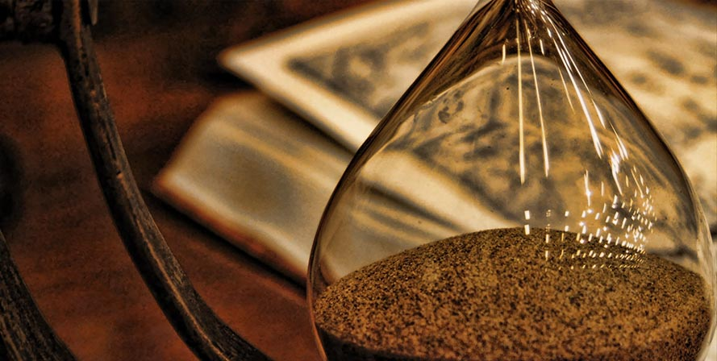

* * *

Sufro de la extraña y aún así no tan extraña dolencia del tiempo perdido. Ya sabes, cuando por culpa de la madures, vejez, o como sea que la llamen, te das cuenta del tiempo que has gastado, sí, gastado, porque decir invertido sería un insulto a todo lo bueno, en cosas sin sentido, y que prácticamente no le sacaste provecho,por ejemplo: videojuegos (sí, sí, no todos, claro esta), televisión (sí, sí, no todos los programas son basura, claro esta), entre muchas otras cosas \*tos tos\* materias en el colegio/universidad que son inútiles \*tos tos\*.

¿Lo has pensado? La cantidad de horas gastadas en cosas sin sentido y que al final sólo te divierten un rato y no aportan prácticamente nada a tu futuro, a tu crecimiento personal ni a tu entendimiento del mundo, no te dan conocimiento ni mejoran tu personalidad, son simplemente basura que atrae tu atención durante horas, mientras con eso posiblemente hagas rico a un grupo de personas que supieron como crear un producto que tuviese a miles consumiendo como idiotas al igual que tu.

Al decir tu, me refiero a mi, a todos, porque a veces me gustaría saber cuantas horas he gastado haciendo scrolling en Facebook, hasta que algo en mi cerebro (te amo pequeño duende trabajador) hace \*Click\* y me doy cuenta que he realizado la misma acción por 5 minutos, o 10, o 15. ¡Mierda! ¡llevo medio día en esto! ¡Qué carajos!

Un refrán popular y sencillo dice algo como "No puedes recuperar el tiempo perdido, pero puedes dejar de perder el tiempo". Ese refrán alberga tanto valor, da tanto conocimiento, y sin embargo, cuántas personas se dan cuenta de que están perdiendo su valioso tiempo, tiempo que jamás volverá, y que tienes contado, porque de que este cuerpo no nos dura para siempre, es la única verdad universal que nadie puede negar.

* * *
