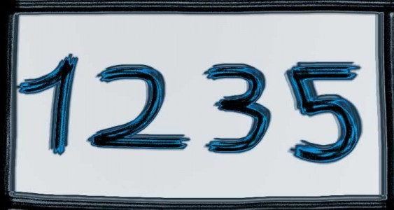

* * *

Escuchaba una canción, tiene dos oraciones en francés, una al comienzo y otra a mitad de la canción. Esas dos frases para mi, aumentan muchísimo mi aprecio por la canción. Entre frustración y atracción decidí buscar su significado, y bueno, en que lenguaje eran, aunque asumía que francés. La segunda frasé significa -uno, dos, tres, cinco-.

## Uno, dos, tres, cinco.

Algo tan simple y aún así tan complejo ¿Cuántas veces necesitaría escucharlo para descifrarlo? No es tan complejo, y aún así tan evasivo a mi entendimiento, llamativo y brillante sólo por el hecho de mi falta de conocimiento, **lo desconocido puede muchas veces ser de lo más atractivo**. Lo oculto grita a nuestros sentidos pidiendo atención, o incluso murmura, porque sin poder evitarlo enfocaremos nuestra atención hacia lo desconocido.

Por miles de años, desde que tenemos la capacidad de levantar la mirada, hemos visto a el cielo y nos hemos maravillado y temido por lo desconocido que existía en la oscuridad de la noche y el brillo del día, a tal punto de en nuestro afán de entenderlo lo idolatramos, hasta el día de hoy, nuestro conocimiento es poco a pesar de haberse escrito tantos libros al respecto.

Lo desconocido es atractivo, porque lo que conocemos sólo representa **seguridad**, una seguridad que siempre quedará allí, y en la que podemos confiar, pero que nos dejó de sorprender hace mucho, y si somos algo, es seres que les encanta sorprenderse.

#### Sorprendente la sorpresa que nos llevamos siempre que descubrimos aquello que desconocemos.

* * *
