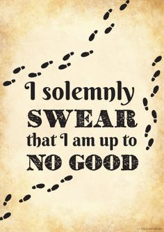
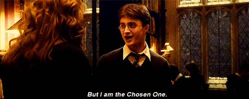

This week I finished one of the best series of books I've ever read, the Harry Potter series.

Here are some of the reasons I totally loved H.P and 7 things I learned from it, in no particular order and referring to different topics. Only 7 of the many, _many_ reasons why I fell in love with the story.

## 1) I love reading.

I've known this for many years now. I've never, ever, read so much as this year, but my love for it has just grown. The love for the art.

It's not about just reading, it's about getting intimate with something or someone else than you. Reading a fantasy book is travelling through space and time, to a place frozen in time that will only go forward as you read and backward as you choose to re-read.

It is to take a journey to the unknown, trusting the story to take you places you've never been before, to teach you things you don't know or that you wish to remember.

Books are not just words printed on paper or displayed digitally, books have a soul of themselves, a soul that is given by all of us who decide to exchange a bit of our life time reading them.

It's a decision I am truly happy to have made with Harry Potter.

For me, it was more than a history, it's always hard to explain when it comes to complex feelings, and this post is a mere attempt to do so.

## 2) A good story makes you worry about the characters, understand them and even _miss _them.

There are few things that make a story not good but **great**. Story, plots, complexity and characters, among others.

The characters in a story, the people in it, need to be complex and follow some rules. You cannot have a dentist shooting a sniper rifle without previously explaining why he wouldn't miss.

The character development in the H.P series is fantastic. J.K Rowling had 7 books to do it and she did it thoroughly and beautifully . You understand Harry, Hermione and Ron, you feel bad for them, happy for them, you worry for their safety and expect the stupid jokes from Ron from time to time. You expect certain things from them, just like you would from your pals. That's very hard to recreate in a book.

> “I cannot remember the books I’ve read any more than the meals I have eaten; even so, they have made me.” -Ralph Waldo Emerson

At the end of the story, I was happy because Harry could finally live a normal life. Yet I was sad because it was over, I knew that our journey together was over, there would be no more "The Boy Who Lived" for me. I know it and it makes me quite sad.

That's what makes this books the jewel they are. I literally miss nonexistent characters from a fantasy book. Almost like I would miss my friends.

## 3) Spoilers Don't Matter.

I started Harry Potter around two months ago,  [my best friend](http://huchonobaka.tumblr.com/) just randomly sent me the audio books so I said, yeah, why not, I had to read this _eventually._  Oh boy. What a ride.

I read the whole serie years after watching **all** **the movies**. Yup, that's right. From The Philosopher's Stone in 2001 (The Sorcerer's Stone in US) to The Deathly Hallows in 2015.  I quite literally grow up along side Daniel Radcliffe, Emma Watson and Rupert Grint.

I remembered almost everything in the movies and (surprisingly) they are very close to the books themselves, so I thought it would be rather dull to know everything that was going to happen already in the books. I was so _wrong_.

Even though I knew the main story line and main plots, there is nothing like a good book to make you feel and live alongside the characters. I was in a spectator-mode journey with Harry and his 7 year [Hero's Journey.](https://en.wikipedia.org/wiki/Monomyth)

> "Spoilers!" -River Song

The spoilers maybe even made the story better, I didn't have to focus so much in the storyline as such and I could pay more attention on the character development of each individual (which is absolutely fantastic).

There was no need to know that He Who Must Not Be Named was going to come back in The Prisoner of Azkaban for me to still be like "OH MY GOD HE KILLED CEDRIC!"

Or to remember that Dobby the elf died in The Deathly Hallows after saving them from Malfoy's Manor for me to cry a little. Ehem, to get some dust in my eyes. That was _so sad, _holy cow.

Overall, fuck spoilers, you can still enjoy a story even if you know it. I wish I've read it without having watched the movies, sure, but that's no reason for not reading them anyway.

## 4) Surprise the reader without thinking they are idiots.

If there is something that puts the H.P series apart from most other fantasy books, is the **huge** amount of mini plots and secondary plots there are. Holy. Shit. Dude.

From Snape being an asshole through the books, just for us to finally understand him _at the very end_ of the series to Dumbledore's brother watching over Harry and being a pub owner (lol).

All this stories, all the ways Harry was able to survive, seemed extremely improbable and just lucky-struck. Yet they feel normal, reasonable even. You don't feel slapped in the face by some bullshit that the author needed to insert just to make sense of a shitty storyline. Nope with H.P, everything makes sense, eventually.

Everything is just the way it's supposed to be. You get so many surprises, you don't know how they will escape next, you know that it is something that only the story can provide. They always got saved, somehow, by someone, without it being weird, it all just fit together so perfectly.

## 5) The little details matter. A lot.

There are an incredible amount of details in the book. Things that you feel are completely casual, end up being part of the main plot 2 books later.

In The Goblet Of Fire, Dumbledore mentioned _totally casually_ that he didn't think to know all the Hogwarts' secrets, mentioning a room that appeared out of nowhere full of peeing pots. Yup, the Room of Requirement, which end up being extremely important all over the books that followed. She just mentioned it because she can, 1 or 2 books before even using it.

I don't even remember, but it happened so many times, and each and every time I got blown away.

"WHAT? ARE YOU SIRIUS? (wink) WE KNEW ALL ALONG? HOW DOES SHE DOES IT!".

Was my normal reaction. In my mind. While my girlfriend was on Facebook.

Details, details, details. They might not add to the importance of the story, but they add quality, they give it body and realism, you feel that everything was there all along, just waiting to be found. Rowling didn't just invented a random room in the 7th floor and called it Room of Requirement, because she needed it in her book, no, you feel like the room was there all along but you just didn't know it, silly you. And that just because she dropped a line about it 2 books prior to actually _using it_.

Did I mention that there are little funny things along all the book? Diagon Alley? Read it aloud. Diagonally. The Knight Bus? The Night Bus? Which showed up one night for Harry? Hah!

One of the things I was most amazed by in the books, are the spells and the amount of names she had to create. The last names. Who comes up with an amazing surname such as Dumbledore? Albus Dumbledore. Potter? Weasley? So, so many things. The spells all kind-of make sense, you know what they are for most of the time just for the way they sound.

Priceless. Gold. Extremely hard to come up with as an author.

## 6) The Masses Know Better & If It's Good They'll Come.

The Harry Potter books are not famous just because they are based on a magical world that lives alongside our "normal world", or because Hogwarts is amazing and they are wizards and witches. The books are famous because they are amazing. The story is amazing, the writing is amazing, the characters are amazing, the ideas are amazing.

Like they say in the tech world, build it and they'll come. Write an absolutely gorgeous story and they'll read it. J.K Rowling had to offer her first draft for The Philosopher's Stone to more than 12 publishers before one of them finally decided to publish it.

Boo-yah on those 12 guys.

The masses know better. It is known as [The Wisdom Of The Crowd](https://en.wikipedia.org/wiki/Wisdom_of_the_crowd#Classic_examples), basically it dictates that overall, the masses will make a much better decision, on average, than any given individual.

It is true with books, this is not something I truly learned with H.P, but that I've noticed. If a book is famous, there a reason behind it. In H.P case, because the books are wonderful.

## 7) There are things yet to be created.

I used to hear this more often when I was a child, before the internet truly boomed and everyone wanted to be an entrepreneur inventing soap for a very specific type of nail. Before the internet showed us all the incredible things humans are creating all over the world, all the time.

J.K Rowling and H.P shows us that, even at this Information Age, there is

still plenty of room to create, there are still Classics to be written, classics my offspring will read, and they better read.  Things that no one has come up with

This is a classic written in the 2000s. Just as The Lord Of The Rings back in the 50s. This are books everyone can enjoy, if you only choose to sit down half an hour each day and let the fantasy pour into you.

## There will always be an end. Almost.

This doesn't count. But there will always be an end. I started reading/listening to H.P simply because _I had to_. It's almost a classic by now. There will always be an end, to suffering, to joy, to perfect moments, the only thing that could defy this, is only, well, _love._

It's a cliche after all, but it's kind of true isn't it?
