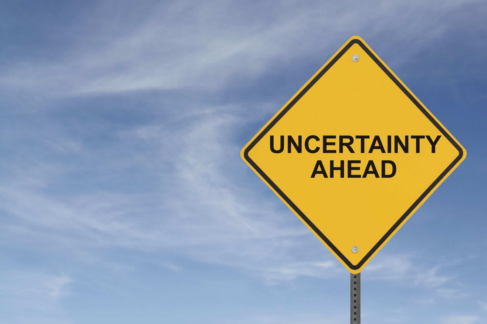

Why Venezuelans Have Lived With A "Dictatorship" For Over 10 Years. By Obed Marquez Parlapiano.

I'm a Venezuelan born man who lived in the country for 22 years before deciding to leave everything behind in the lookout for change, opportunities and a better life, in which not to worry about being killed, robbed or dying of boredom while waiting outside a supermarket.

\[caption id="attachment\_1997" align="alignnone" width="3000"\] People wait in a line to buy staple items outside a state-run Bicentenario supermarket in Caracas August 8, 2015.  REUTERS/Carlos Garcia Rawlins\[/caption\]

I have to say I succeeded. I'm now happily living in Malta, a small island in the Mediterranean sea with people a bit similar to my former kinsmen. They are warm people, happy people who complain about life as everyone does, it's a family centered society that is struggling to combine their long held traditions with the never ending waves of globalization that refuse to leave them alone (Citation needed).

For many, many years I have been asking myself a question, one of the hardest questions I've had. **Why Venezuelans are the way they are? Why do** **_we_** **accept such an oppressive and obviously** **_terrible_** **government? And most importantly,** **_why is half (more or less through the years) of the country supporting the regime, with millions of followers still to this day?  _**

As you might expect, this is not an easy question. It involves many, many different layers of complexity, factors and social variables. It requires the study of the way Venezuelans live, socio-cultural values, economic incentives, traditions, and something I never thought of until a few days ago, something that finally helped me answer this question fully.

If we want to understand the present, we need to look into our past in order to understand why the culture is the way it is.

I never fully considered the implications of our past as a society and the history of how not only Venezuela but most of Latin American countries came to be independent. I am very aware that cultures are shaped by their history, nevertheless,  there was always something missing in this puzzle for me, I simply couldn't find the piece that would make sense of it all and fit everything together.

This was until I read **Outliers: A story of success** by **Malcolm Gladwell.** This book changed the way I see the world and gave me the missing bit I so eagerly desired.

\[caption id="attachment\_2017" align="alignnone" width="2048"\] Courtesy of: luisbox.com\[/caption\]

Before continuing, I have to say that I’m not a sociologist, psychologist or an academic, I’m simply a thoughtful guy who wishes to understand the world around him and understanding why the people I lived so closely with for two decades behave in such a different way as I do and as some of my close friends did was a very, very attractive — and challenging — question. I have to say as well that I am referring to Venezuelans as a society in general, there will always be individuals that do not follow the trend but what I’m interested in is the behavior of the masses. The masses that one way or another, continued to vote for the government or failed to instruct their peers to vote against them.

In **Outliers**, Gladwell explains that success is not only based on personal merit and hard work, that the best of us are not at the top of the pyramid simply because they worked harder or smarter than the rest but because they had a lot of opportunities along the way that differentiated them from the rest, a combination of luck, **culture** and particular circumstances provided this success examples with a rich soil in which they could sow hard work. The book covers from Bill Gates, to Billy Joy and more, showing that their amazing success is due to much more than wits and power of will.

In my opinion, the book as a whole is amazing, eye-opening and inspiring. There is a whole chapter dedicated to why Korean Air — South Korea’s largest airline — had the highest rate of plane crashes in the 90’s in the world, up to the point of a highly covered [crash in 1999](https://en.wikipedia.org/wiki/Korean_Air_incidents_and_accidents) that led to a review of the whole company in order to find the culprit of these multiple incidents. This is the chapter that interested me the most.

Gladwell explains that the reason for their high rate of crashes was not the lack of training of their pilots or planes with faults. They were as good as any other pilot, with planes in perfect conditions. The culprit was instead **the cultural background** of the Korean pilots. In Korea it is deeply engraved in their society the politeness in which you talk to your superiors, in fact, it’s much more than politeness, a lower ranking official doesn’t contradict a superior’s decision, even if such decision is obviously incorrect. This led to anyone in the cockpit apart from the main pilot, to be a subordinate, _even the co-pilot_ which is supposed to take over a plane if need be, to not speak up in times of need, mostly when the pilot was making mistakes. This led to crashes. It led to co-pilots not taken over when they had to and to engineers not speaking up when the weather was bad and the pilot still decided to go through the storm anyway.

It was not the airline's fault in a direct manner, it was a cultural barrier that needed to be addressed. It was the history of the Korean and the moral code they had, which developed through history to the point of having mainly 4 different ways to address your kinsmen depending on their rankings in society relatively to yours.

While explaining this, Gladwell mentioned something very interesting, the **Power Distance Index.** It was developed by  [Geert Hofstede](https://en.wikipedia.org/wiki/Geert_Hofstede) as a cultural dimensions theory which explained the barriers on communication created by culture, the different ways in which cultures see authority and respect it, and how equally one citizen sees her peers.

When I realized what this was, I gasped. This was it. This was the theory I needed in order to explain why Venezuelans had to deal with a semi-dictatorship in an oppressive, wanna-be totalitarian joke of a government. Hofstede's theory explained it at last.

\[caption id="attachment\_1814" align="alignnone" width="543"\] Hofstede's Data for Venezuela - Courtesy of [ClearlyCultural.com](http://www.clearlycultural.com/geert-hofstede-cultural-dimensions/power-distance-index/)\[/caption\]

Venezuelans have very bad figures in Hofstede's data. We have an extremely high **Power Distance Index**, which refers to how much we respect authority and how we see our peers based on the power we or they yield. The individualism in the country is very, very low, which means that Venezuelans on average are not individualistic citizens. The society is highly focused on masculinity and a high  **Uncertainty Avoidance Index** shows how much Venezuelans hate Uncertainty. I will connect each one of these figures in order to answer my long lasting question.

### **Venezuelans Respect Authority Too Much**

This can be a good thing if you have strong, long standing laws and a prosperous country and government. But absolutely terrible if you have to deal a quasi totalitarian government, one that is too silly to actually be able to become totalitarian.

The United States has a Power Distance Index **(PDI)** of 40. Half of what Venezuela has. This means that they respect authority, but not too much. They are positioned in a good middle. Respecting authority is important in order to run a country properly, you need the people you _serve_ as a authority figure to follow your command and the rules, but they don't simply throw themselves into the abyss if a superior asks for it. Please remember these are averages, it will change if we focus only on certain states.

\[caption id="attachment\_2038" align="alignnone" width="549"\] Hofstede's Data for Venezuela - Courtesy of [ClearlyCultural.com](http://www.clearlycultural.com/geert-hofstede-cultural-dimensions/power-distance-index/)\[/caption\]

On the other, very different end, we have Venezuela with a 81 **PDI.** They respect authority too much (I will refer to Venezuelans as _they_ in a way to distance myself as the author in an objective manner). They follow rules and are not eager to stand up against an authority figure. The high **Uncertainty Avoidance Index** plays a role in here, they dislike the prospect of the unknown, making it even harder to stand up and fight a possibly losing battle.

This lines up with what I've experienced. There have been opposition to the regime for many years, getting stronger and weaker depending on the season. But the opposition never _really_ opposed the government fully, they only made parades and accused the government of corruption on TV, big deal. There were a few very reserved and feeble attempts to overthrow the government, all of which failed miserable and most of the opposition didn't follow or supported directly.

The reason being is that Venezuelans, culturally, are hand-made to obey. They try to oppose, to stand up and speak and they do, but in a preserved way, not giving it all because they fear the uncertain, they want to have half a feet in the safe side of the equation at all times, _just in case_.

**Por si acaso**,  which translates into _just in case_ it's a very common expression in Venezuela. They (we, I still do) are always '_just in casing'_ everything. And this aligns with the history of our people.

Venezuela's "conquest" started by the Spanish crown in the 16th century. There was no real state-like indian government—like in Mexico for example—, there were a bunch of different tribes all over the country minding their own business.

But they were slowly forced to either obey (which most did at the end) or die (which some did very, very fiercely). This obeying the master type of culture is still deeply engraved in South American society, you only need to have a look into most of the South American countries to find similarities in their PDI and Individualism metrics. The "white man" was of importance for Latin American culture until not long ago.

Now, let's go into the Individualism figures.

### **A Society With Low Individualism Is Easy To Control**

Australia, the United States and the United Kingdom all have a high **Individualism** values (90,91 and 89 respectively), meaning that they are —wait for it—individualistic. They don't require an entity, group of people or government to take care of them, _ it is expected for them to take care of themselves_. The US or the UK are a good examples of the "You are a capable part of society and you can succeed without us helping you every step of the way" society, a good example is the lack of public medical care.

\[caption id="attachment\_2080" align="alignnone" width="545"\] Hofstede's Data for the UK - Courtesy of ClearlyCultural.com\[/caption\]

Venezuela in the other hand, has a Individualism metric of mere **12\.** I need to emphasize this, [**_12!_**](https://en.wikipedia.org/wiki/12_(number)) Comparing now the Venezuelan culture and government traditions, they have always given a lot of support to society, low and middle class. Not in a capitalistic type of way, but in a more social way, loans with almost no interest, free public health system and **free school and university** **systems**. It is to the degree that in Venezuela there is a proverb stating "If you throw a stone to a crowd, you will hit an Engineer". And if you don't hit an Engineer (or a doctor for that matter) you will hit a Lawyer, Teacher or Accountant. The amount of social benefits that Venezuelans have is staggering.

And it all got even worse with the Chavez government. Almost all of the low income class had some sort of incentive to _not work_ and get social benefits.

I'm not arguing the point that this is bad. Countries like Norway have proven the fact that **this is a good model,** if implemented correctly**.** And I would be crazy to complain about receiving my education for the best of 3 years almost free of charge.

The individualism of Venezuelans is low, not because they don't think for themselves (many of which, with all due respect, don't) but because the government and even themselves don't expect to be a capable and productive part of society. This is not to be understood as that there are no highly individualistic Venezuelans, which there are, many. These values, once again, are an average or society in general.

The problem with a low individualistic society is that, when you give them social support the way the Venezuelan government does, the people tend to feel bonded to their helpers by it. I can't say how many times I heard phrases like "The government gave me this, therefore I should vote for them", or "You are receiving this for free, how can you not be grateful".

Well, I was grateful. Giving support to your people _cannot_ mean that they own you their loyalty. The government's job is to help the people it _serves,_ to be successful. Millions of Venezuelans feel like Chavez owned their souls, and they were happy of it.

### **Masculinity—73.**

The point of this article is to explain why Venezuelans have been in a semi-dictatorship with a downhill government. There is probably a reason of being kind of a pro-macho country, but I don't see an obvious one here, email me if you find one.

### **Very few people like uncertainty, Venezuelans hate it.**

Being able to deal with uncertainty is a crucial part of success. In business as well as in life you will have to deal with high uncertainty when making an important decision, most of the time the higher you bet the higher the winnings. Achieving success without having to throw the house out the window is all about balancing what could possible go wrong with the returns of the possible winnings, and still have a roof on top of your head at the end.

Venezuelans simply crash in a high-stakes decision. They blow up, I've seen it (citation needed).

\[caption id="attachment\_2099" align="alignnone" width="2508"\] WHAT? PERO DIOS MIO! AYUDAME!\[/caption\]

This is something **so, so important**  for a society and a government. There is no possible growth if you continuously do the same, over and over.

There is a proverb that says "better stay with the devil you know than with the one you don't". Basically, you better stay with something bad you understand that with something that you don't, even if it could be much better, because **it could be worse,** and who wants a worse devil? Again we see low PDI, being unable to challenge the status quo in an attempt to be better.

This is a bad thing if you are trying to overthrow a long-standing government. The opposition wants furiously to get rid of them, by doing the same things that didn't work in the past.

To a man with a hammer, every problem looks like a nail.

Even the "officialist" (government supporters) voted for a candidate most of them didn't believe in or trust. When Chavez died in March of 2013 and the elections took place shortly after, most officialist voted for a candidate with no previous political experience, no background, no studies or simply nothing to prove that he could possibly do any good by running a country already in deep crisis. I'm being 100% objective here. Nicolas Maduro used to be a bus driver that was chosen by president Chavez to be part of his team, for no particular reason. Choosing him as "predecessor", for no particular reason neither.

Officialist hated the uncertainty of choosing a different candidate, feared the possibility of having someone else that their so loved dead leader didn't appoint to them, even if that predecessor was a bag of potatoes, which it almost was (not being objective here).

### **But things can change.**

Fatalism have not helped anyone, ever. The future can be bright.

Things can change for such a gorgeous country as Venezuela and it's warm, crazy and so varied people.

I'm not talking about changing government, [which I hope happens soon](http://www.bbc.com/news/world-latin-america-35019111) and with  the Congress elections in which the opposition won a vast majority of seats are a good sign of it.

But I'm talking of a change in the core, in the root of the issue, an understanding of **where** **_we_****, Venezuelans, come from and where to go next.** That's the question and answer needed in order to prosper.

The need to understand the past and how it influences us is crucial to our future, in every culture, in every country. Venezuela has a rich complicated history, the country and it's people are still evolving, and that's fine. But it's crucial to understand the way the culture affects the population and their behavior.

We are reflections of our genetics and our environment. The decisions we make are a lot of times based on more than our consciousness.

I deeply believe that knowledge leads to change. Being aware of this will lead to change, not in a year, maybe not in a decade due to the terrible conflict and economics of the country, but if I can see the land that gave me life for best of my life to prosper in my lifetime, if I can show my daughter part of my past when she is an adult then I will be happy.

We are all able to prosper, to evolve and get better at life. Human nature seeks peace, happiness and wealth. Not just monetary but social wealth,  communities thriving, families growing together and not knowing fear.

And we can achieve this by understanding where we come from and where we want to go.

We come from a deeply conflicted continent through the centuries. Let's go and build a unified prosperous country. Let's make the deserts in the north-west shine along with the snow in the south. Let's preserve the biggest of the rivers and the life of the Amazonian forest. Let's keep it being the natural jewel of the world. Not just because of what God gave the earth, but because what the people made of it.

\[caption id="attachment\_2134" align="alignnone" width="1024"\] Yellow for the gold in our earth. Blue for the blue in our oceans. Red for the blood spilled by our ancestors to achieve independence.\[/caption\]
