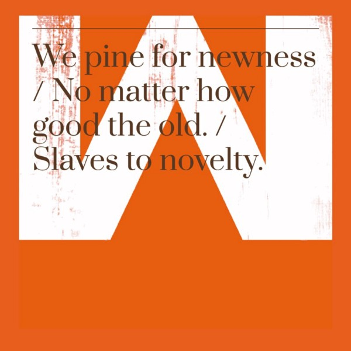

## And how to achieve long lasting happiness.

When thinking about success, our minds focus inadvertently on money. **Money is king** in the world we live in, for many, many reasons. Not just because it buys nice shiny things \*insert Ferrari here\*, but because it provides power to the bearer. The more money one has, the more power. And what else is success but power?

Power is and can be many different things; power over others, power of one self — known as [Enkrateia](https://en.wikipedia.org/wiki/Enkrateia), enlightenment or whatever your philosophy is—, power to be able to provide to your family and loved ones, to create, to help, to destroy. **Power, therefore, is success.** When someone says _“I want to be successful”_, they are simply saying that they want to be more powerful on a specific field of their life. To have the power to travel more, work less or simply **the power to be happier.**

In order to be successful many times we look for a close cousin, productivity. When we think about productivity we automatically associate it with doing things in a better, faster, more efficient way; that’s what productivity is to a success-or-nothing society. We need to create and do things in order to gain more power in such field of life and the more productive we are in doing them, the faster we’ll get to that “I’m finally successful” point, right? _Right?_

Want more money? Work better and smarter, make a startup. Want to be more sociable? [Learn how to win friends and influence people.](https://en.wikipedia.org/wiki/How_to_Win_Friends_and_Influence_People) The list goes on and on. Basically, be more productive at that specific field of life the more successful you’ll be, faster. We are evolution’s most valuable player, the Michael Jordan of adaptability, the Stradivari of problem solving; evolution dictates that the most fit and well adapted _always_ wins: a.k.a the most powerful.

#### The more we do, the closer we get to being successful.

But what if this isn’t the reality? The truthful truth. Do we really live only to be successful? Why are we all chasing the same ethereal goal? Is our life worth our bank account’s credit, Twitter followers or the amount of Facebook likes we have?

#### What is success anyway?

Is it to have a job you love? To work in a job you hate but that gives you riches? Is it to simply _be rich_? Famous? Sexy and desired?

Most of us consider rich people to be successful. Celebrities, famous entrepreneurs; they all fit into the “successful people” box, they are all powerful in their own way. And _obviously_ these people are productive, how else can they be so successful!?

Productivity dictates that **time + focus + goal = results**.

We have control over two of those things, our focus and how well crafted is our goal, but a day only have so many hours, _we have to_ squeeze every last bit of time out of our day in any way we can, how else can we be successful?

But what is it good for, to eat a meal — a nice one mind you — while rushing to finish it because _time is money!_ Better watch a video on Udemy, maybe we can learn something out of it; to read [Think & Grow Rich](https://en.wikipedia.org/wiki/Think_and_Grow_Rich), the law of attraction should help people come around this post. Make it rain, Universe!

> What is it good for to work that many hours a week in order to keep that startup from drowning, or the boss happy, if at the end of the day our kids went to sleep without dad’s or mum’s kiss on their foreheads to wish them sweet dreams?

There is time for — almost — everything in this life of ours. We are all looking for the exact thing:

### Happiness.1

#### Simply, good old happiness.

The modern world has fed us up with the idea that success will make us happier, better or more worthy; it will bring us to cloud 9 in the weekend and back to nirvana for the weekday.

Money does not buy love, neither does it make you feel more alive the more digits there are in your bank account. It wont bring back your children’s early and lovely years, your loved one’s sweet smile or your health.

The only thing that bring true happiness is to live life. Not _to be alive_, but to_live life._

### Novelty is the worst enemy of happiness.

\[caption id="" align="aligncenter" width="600"\] From a great Courtney Symons Medium post\[/caption\]

We all desire to travel the world discovering our beautiful planet and ever-evolving history, but the only reason we want to do it is because of that _almost_ authentic happiness that fills our hearts when we find ourselves in new places, surrounded by all sort of new scenarios that makes our mind wonder in a day dream.

But it’s not the journey that brings us joy, is the novelty of it. **We’re new here!** New language, new culture, new architecture, new corners to be crossed and lovers to be found.

We’re simply addicted to novelty; new car, new last-model-on-earth phone, new house and partner. Some people are looking for a brand new life all together. We’ve grown too bored of this old thing already.

> Let’s change our name to Brad and live in the Caribbean, with an ice cold Mojito in one hand and a Piña Colada in the other.

#### We’re functional junkies of novelty

But just as as the drug dissolves in your blood stream the more it travels through your veins, leaving only the desire of more to come, only the memory of ecstasy and chemically reactive happiness, the same will happen to our novelty, it dissolves and becomes nothing but a memory and a desire for more to come.

And we wish to have more money in our pockets so our next plane ticket will take us farther away, just for our injection of novelty to maintain the ecstasy a little longer this time around. Or so we wish.

Our phones are not trendy anymore, our car start to sounds weirdly and our clothes are… from the last season, _yeicks_. We start to get used to seeing the unfamiliar faces in this new place, to know the streets and corners, the language becomes strangely familiar and so does our disappointment. We become registered residents of Wonderland.

### Solution: to live life.

#### Seriously.

There’s nothing that will bring us more long lasting, true happiness than living life. Living in the today, the now. Yesterday is a figment of our imagination and the tomorrow’s smiles will only come from the love of today.

Look at the things that surround you, find the beauty in them, not the _novelty of them_ but the every day beauty.

Walk slower, pay attention to the infinitely different hues of green in a park, the amazing daily evolution of a flower. Watch the blue sky change into twilight darkness, promising an impossibility of promises within its mind-bending depth.

Let your senses be ecstatic as you savor that beautifully made burrito that Carlos made you 5 minutes ago with doubtful ingredients as your mind wonders aloft and relaxes, preparing itself for yet another round of this boxing game we call **Life Of Ours**.

#### Success is wonderful, but never insult yourself thinking that it is the most important thing.

Don’t let power become the only thing you seek, don’t let novelty be the main driver of your life’s happiness. Just because something is not trending any longer it becomes less wonderful, less beautiful or less functional. **Don’t be a novelty junkie.** Be a life liver instead, feel and experience every day, not as if “it was your last day”, but as if it was a day which will truly never return, because hey! It wont.

Look closely at your partner, at your mother, at those who truly love you and find your own reflection in their eyes. Look at yourself through nature’s living mirror and you will realize that _life is worth living._

#### _Enjoy the journey. Enjoy this journey we travel together._
