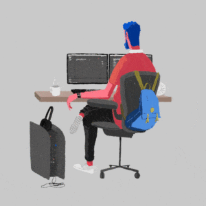

We're constantly bombarded by the idea that to achieve greatness all we have to do is _just _work a bit harder. Wake up earlier, do more exercise, focus more and distract yourself less, this and that. But how do we actually become better, how do we become who we want to become?

Just a few years ago it was almost an accepted theory that _willpower_ is a finite resource, meaning that the more decisions we make that require willpower, like not eating sweets or avoiding Facebook, the less willpower we have left for other important things, like working.

There is [plenty](https://www.wired.com/2012/10/mf-willpower/) of [articles](http://scopeblog.stanford.edu/2011/12/29/a-conversation-about-the-science-of-willpower/) and [research](https://www.apa.org/helpcenter/willpower-limited-resource.pdf) pointing to the same result. However, after scrutinising the studies and methodologies further psychologists found that this "finite willpower" theory seems to be a myth or at least a not well understood behaviour. Most experiments that seemed to confirm the theory are hard or impossible to reproduce, and being able to reproduce an experiment is the cornerstone of science. Totally recommend [this](http://nautil.us/issue/45/power/against-willpower) article on the subject. Where did we end up? Nowhere, some swear we have finite willpower and others the opposite. Believe as you wish to believe, for now.

Here I try to explain a bit of my journey, how I managed to become more of the person I wanted to be, and less of the one I didn't want to, without turning to self-help books and grandiose gurus. Turns out it kinda just happened.

Most people wouldn't call 4 years a very long time. If you think about it, how much can a person change from their 20s to their 24s? Or from 30 to 34? Surely 4 years is a lot of days, a lot of time to learn, to experience, to travel and meet new people. Surely we move forward and sometimes backwards in such an extended period of time, but how many of us would say that 4 years ago "I was a completely different person"?

At beginnings of 2013, I was studying Computer Engineering in one of the best universities of Venezuela (totally biased here, though), I was irresponsible, didn't study hard enough, didn't take my career as seriously as I should have. I flunked Mathematics multiple times as well as one of the most interesting (I didn't know it at the time) classes in the career, Data Structures, in some cases for just a few points missing in an exam or project. Points I could have had by being a bit more careful with my code and organisational skills.

Don't get me wrong, whenever I studied I passed easily, I was (and I continue to be) quite good at this coding stuff (I'm biased here as well, obviously), and that's the main reason I flunked so much. Overconfidence. I always believed I could achieve what I wanted if _only_ my effort was _just_ enough. I still hold this belief, but I don't sit on my ass waiting for good stuff to happen anymore, you gotta do the work.

In the summer of 2014 after leaving an amazing company I was working for, I took a plane to Italy. Convinced to leave my country and to move somewhere offering a brighter future. I ended up in a small but prosperous island called Malta, with good people, nice sun and a _lot_ of cats.

Fast forward a bit and I'm meeting this beautiful woman whom I had no idea would become my partner in life. We had the most amazing daughter together, after 9 months of turmoil and adapting to the new idea of being a parent-to-be. I barely knew how to make a website back then.

During that time I started reading books on a constant basis, challenging myself to read a book a week and ending up reading around 72 books in 2015. I started building websites to have better work experience in my field (I dropped out of university before leaving). I started to slowly become more of the person I wanted to be. Obed 2.0 if you want.

Now here we are, 2017, I went from playing until 2am and being unable to properly function the rest of the day, to waking up at 6 am and writing this in my free time instead. I'm proudly a web developer, learning new things every day. Still trying to read a book a week while my daughter steals the book out of my hands whenever she sees it, or my tablet, or my phone, or really, anything that is stealing attention from her.

Whenever I look back to the last 4 years, I'm astounded by the enormous changes I've been through. I'm still the same person, I've played a hundred hours of video games in the last few months or so, but I've also built a lot of new things, read a lot of books, learned so many new pieces of information I might someday use. I'm still me, just a much better me, one that I can be proud of.

What I've learned in the last few years is that there are two things that drive our change, one comes from within and we have some control over it, the other one comes from the environment and we have little control over it.

## First, what drives change in us is ourselves.

We need to _want_ to be better, and more importantly, you need to _believe_ you can be better. You can't improve and move forward if you're content with where you are and who you are, you won't improve if you believe you're unable to. Maybe the environment will force you to change, like a caterpillar becoming a butterfly regardless of their wishes, but the power within ourselves needs to be constantly nurtured, like a fire that dies without enough care.

All these might sound like taken from a motivational speech, but there is strong evidence suggesting that our beliefs dictate the outcome of our own endeavours, think of a self-created placebo effect. Have you ever heard the saying "I'm just not good at..."? Or "...is not for me", "I can't do...", "I'm just not fit for...". Now insert math, physics, coding, writing, being a leader, or any other skill that requires effort in any of those sentences. I wasn't born knowing how to make a computer do what I want it to do, or knowing how to write what I believe are decent blog articles/

None of us is born knowing anything, yet at some point, between the world teaching us everything we get discouraged by the same world showing us only the geniuses and the system constantly telling us how stupid we are. Eventually, we lose the ability to believe in ourselves, but truth is, we can do almost anything we set our minds to. You don't have to love Math to be good at it; like any other skill, it can be mastered through practice, but by telling ourselves "I can't do this, I wasn't born for this, it's just not for me" we put an invisible barrier that we will never overcome.

We are who we want to be. Our genes have a huge impact on who we are, but we can overcome even the limitations of our genes with effort.

## Secondly, the environment forces our behaviour and mindset to change.

I threw myself into a completely different environment in 2014. A different continent and a new country, with different people, traditions and culture. Without friends or a family to run back to if everything went downhill. I suddenly had to compete with other people that, in my eyes, were far better off than me. Top it up with the realisation that you'll be a father soon and you have either the perfect recipe for disaster or for greatness. I might as well choose the good one. It wasn't easy, none of the 2 last years have been easy, but life is never easy and whenever it becomes easy, you're probably in a rut.

My environment is no longer what surrounds only me, but it's what surrounds my family, it's what might surround my daughter in the future. Will she have a good future? Does it depend on me? I don't know. Just as my mother couldn't help shape my future anymore after I stepped into that bus to the airport, I won't be able to improve the future of my daughter forever. But I will most surely try to make it as prosperous as I possibly can.

I didn't choose to be motivated by a blond little human that runs around like a penguin destroying everything in her path. I might as well say she choose me instead. I really didn't plan to end up in Malta or to start a family, but that's my life now, it moves me forward and helps me evolve, probably faster than being alone would ever have.

I'm not saying anyone should suddenly decide to go and have a baby to see if they become a more mature and responsible individual. But as Albert Einstein (might have) famously said: "It’s often said that the definition of insanity is doing the same thing over and over and expecting a different result.".

> "It’s often said that the definition of insanity is doing the same thing over and over and expecting a different result."
> 
> Albert Einstein, maybe (we don't know for sure who said this).

Maybe you feel constrained by the world surrounding you, or maybe you feel you don't have the internal strength necessary to break free from the clutches of your own self. In either case, a change of environment could be the best thing to help you break that cocoon.

I'm lucky. I'm stupidly and incredibly lucky. I'm white, tall, well mannered. I was brought up by a loving family, got my education, some good genes from my university-graduated parents, good nutrition. I'm in the top percentile of humans that can say such good things, for me to be saying something like "You can do it!", can be rather hypocritical. A lot of who I am and a lot of who I could ever become was decided long before I was conscious enough to realise who I actually am.

However, thinking that our past, our families and our genes have already decided our present and future, to think that everything has been written down and that our destiny has been decided is the type of obtrusive and negative mentality that prevents us from becoming great, the one that doesn't let us evolve. So in either case, I'll always try to choose the option in which I can continue to improve.

In either case, I'll always try to choose the option in which I can continue to improve. Is it my very nature the one that makes me behave like I do? Do I believe in the power and the beauty of humanity because it's hard coded somewhere in my DNA? Maybe, until I know it for sure, I'll continue to believe we can all become great.

Shouldn't we all?
