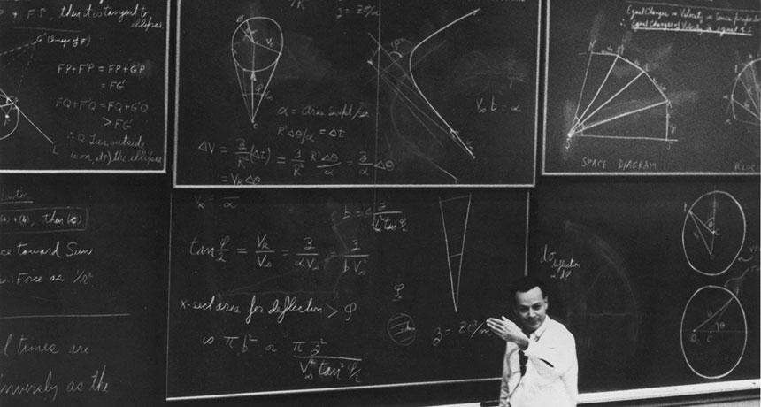

In 2016 I stumbled upon a book called "The Pleasure Of Finding Things Out" by Richard Feynman, it was a collection of some of Feynman's best stories. The book was so good that shortly after finishing it I read "Surely you're joking, Mr Feynman", a book of a similar nature. Both of the books give glimpses into Feynman's life, his ideas, experiences and outlook on life itself.

Feynman's accomplishments are quite astonishing. He won the Nobel price in 1965 for his contributions to the development of quantum electrodynamics, he helped advance the field with new equations and ideas, pioneered the idea of quantum computers, [helped Nasa](https://en.wikipedia.org/wiki/Rogers_Commission_Report#Role_of_Richard_Feynman) on the space shuttle Challenger explosion, was a beloved professor (even now, recordings of some of his classes have millions of views on [Youtube](https://www.youtube.com/watch?v=36GT2zI8lVA)), but most importantly, _[he played the bongos](https://www.youtube.com/watch?v=qWabhnt91Uc) _like _you can't even imagine._

> “The highest forms of understanding we can achieve are laughter and human compassion.”
> 
> ― Richard P. Feynman

Apart from his many accomplishments, everyone always agreed on something: Feynman was a curious character. He was a master of curiosity, of living life the way he thought it ought to be lived, experiencing things and giving himself fully into them. The books mentioned above are great not because of what he accomplished, but because they portray the life of a man that you would never guess was an incredibly smart theoretical physicist.

Imagine you see a man dancing in the streets of Rio De Janeiro while banging the bongos and having the best of times. Would you guess he was going to become a _quantum _physics Nobel laureate? Or that he would work alongside the most brilliants scientists to create the atomic bomb? And that while at it, he'd also crack open a few safes in what should've been the most secure place on earth?

The answer is probably: no, no, and _what..? _Did I mention Richard Feynman was also a great safecracker? The guy was full of surprises.

The whole point of praising the guy it's that he did a hell-of-a-lot of things in his lifetime. Worthy things! Without sacrificing the pursuit of distractions and hobbies.

I've always thought of distractions as something to be avoided, as the enemy of productivity and the antagonist of good work. Turns out it doesn't have to be that way. Distractions are a necessity to do productive and effective work. Sometimes distractions become the best work we do.

Richard Feynman had many cool stories to tell, but most of them are not about his theories or the equations he came up with. Most of them are about the time he got distracted by or with something, from picking locks and opening safes, to counting the time on his head to try to match the accuracy of a clock. The guy had a million super interesting hobbies, but that never stopped him from doing good work.

> “Physics is like sex: sure, it may give some practical results, but that's not why we do it.”
> 
> ― Richard P. Feynman

## How did Richard Feynman combine work with distractions?

In "A Mind for Numbers: How to Excel at Math and Science", Barbara Oakley explains that some studies suggest that we have 4 working memory slots or "storage spaces". These slots are used to keep information fresh while our brain downloads, sorts and stores the data into long term memory. These storage spaces are in the middle between short-term and long-term memory, easier to access than long term and more time enduring than short-term but limited in capacity.

Remember studying a hard subject like math or coding? Or trying to keep up with Game Of Thrones' plot lines? In these cases, your brain was storing all this information in one of those memory slots so you could easily access them without spending time searching through your long-term memory to find out who Daenerys is or what that code function does. The information was readily available.

Your mind then needs to "churn" or "chunk down" that information into patterns and store it in long-term memory, where it will can be slowly but reliably accessed.

But since we only have 4 memory slots, we have to be careful what we use them for. On a typical day, you might think about what groceries to buy, about calling your mom back, and about that discussion you had with your partner. Now you've used 3 memory slots, having only one left for deep, meaningful work. (I'm oversimplifying here, but you get my point)

Our mind is great at "chunking" information down, connecting dots and recognising patterns, that's why it's so much easier to remember stories rather than historical dates. I can tell you about Genghis Khan's empire and his conquests, but not the dates in which any of it happened.

How did Feynman manage his memory slots? By connecting his distractions to his work. He used the nonsense in his life as a way of doing heavy work.

In one of his stories he explains how after joining the California Institute of Technology (Caltech), he struggled to do any meaningful science. He had stopped having fun and took it all too seriously.

One day he started scribbling some equations out of curiosity, solving one problem lead him to another, eventually leading to the one that won him the Nobel prize.

Our subconscious can help a great deal when we're stuck on a problem. Our mind doesn't give up on hard problems, but it needs time to find solutions. That's why you get your best ideas in the shower or while driving. Because you're on a relaxed state of mind, where ideas can flow freely and you're not focused on a specific challenge.

Distractions, memory, ideas and problem-solving are all connected, and they work in unison if we let them. The problem is that we're surrounding by non-meaningful distractions.

When was the last time you had a meaningful idea while watching Netflix or browsing social media?

Everything must have a purpose, including distractions. Our mind works by storing information and solving puzzles with it, turning bits of data into knowledge. Ideas are the atomic juice that drives us forward and helps us use and adapt to our amazing new world in amazing new ways.

As the Stoics said, we don't live this life to enjoy the pleasures of the body but to endure the hardships of the mind.

> “Nobody ever figures out what life is all about, and it doesn't matter. Explore the world. Nearly everything is really interesting if you go into it deeply enough.”
> 
> ― Richard P. Feynman

* * *

This was a hard-to-crack article for some reason. The first draft dates back to 2016. I think I revisited it in 2017, and after 10 revisions in the last 2 weeks, here it is!

I tried to cover a lot of ground, without writing more than necessary, which it's something I'm still trying to learn to do.

Hope you enjoyed! Share your thoughts :)
