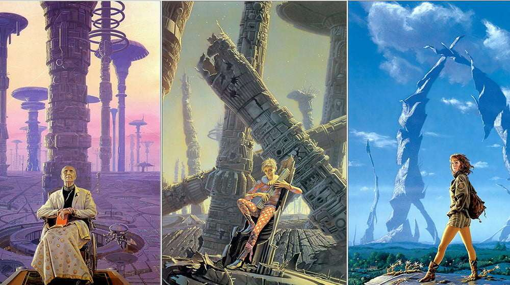
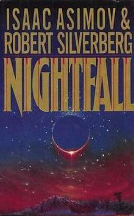
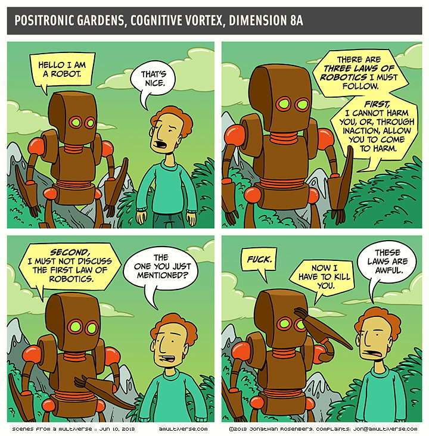
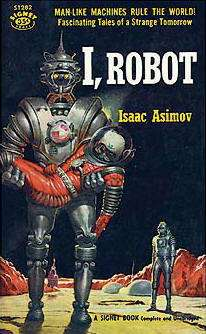
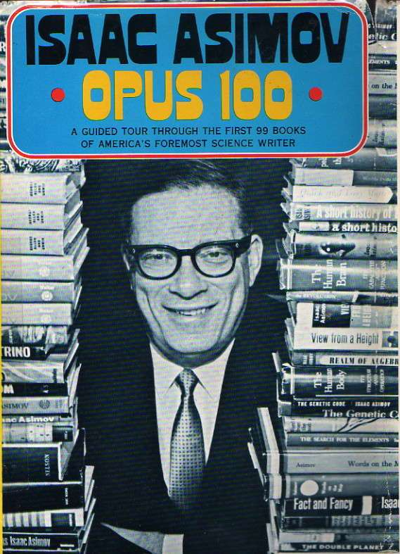

I discovered Asimov when I was about fourteen. I loved that we both shared a name, Isaac and that he pioneered the idea of robots and the three laws of robotics. I was struck by his genius and read a lot about him before even touching one of his books.

Isaac Asimov was a grand-master of storytelling. Asimov's short stories were superb, winning many awards throughout the years and being his main way out literary creation for many years. Some short stories like "I Robot" became pillars of science fiction.

I've always felt strangely connected to Asimov's tales, as if he wrote his stories _for me_ specifically. His stories have an uncanny ability to make me feel identified with them in some way.

Perhaps that's the quintessential writer, one that can make people feel connected to the stories they're reading.

## Breeds There A Man . . . ?

If Isaac Asimov was known for his short stories then the Foundation trilogy made him outright famous. The first and second books were first written as a set of short stories and later put together as books.

The Foundation trilogy cover art

It's interesting to note that when the book came out it barely made any sales. It wasn't until years later when Asimov's main publisher bought the rights to the books, republished it, and saw the birth of a science fiction classic.

But where I believe Asimov's genius truly shines it's in his short stories. "Breeds There A Man . . . ?" It's one of such amazing tales.

It touches on the idea of the Earth being an incubator of life. The same way we cultivate bacteria in order to study it, an advanced life form has cultivated Humankind in order to study us. The same way we clean off the Petri dishes when finished our biology class, this life form uses war and catastrophe to control humanities' technological advancement.

Think of the Roman, Greek and Chinese (to name a few) highly advanced societies that after war or catastrophe became nothing more than a history lesson. All empires will eventually fall, goes the saying.

These theories are explained by the main character, Ralson, whose understanding of history has led him to suspect that an all-powerful being it's controlling humanities actions. However, Ralson's strong suicidal impulses and overall craziness doesn't lend him much credibility.

Ralson is a scientific genius with a one-of-a-kind mind able to solve problems no one else can. He's eventually brought into a super-secret project that will create a city-wide atomic-shield. An invisible shell that can protect entire cities from nuclear bombs. This device would make a nuclear holocaust impossible. Therefore, Ralson argues, taking control away from these all mighty beings by protecting humanity from itself.

Ralson, as well as many of the core contributors to the project, eventually commit suicide, leaving mysterious suicide-notes behind, all of which point to an external force pushing them into ending their lives.

I love the ending of the short story:

> "You **believe** Ralson?" Asked Grant in horror.  
> "I don't really know"  
> Blaustein looked at the stars.  
> Incubators?

## Nightfall

Asimov was an extremely prolific writer as well, with more than 300 books written and more than 400 pinned by him, he wrote about education, history, religion, chemistry, science and more. He wouldn't be a great writer if he had only dwelled in science fiction.

In fact, the huge majority of Asimov's books are not sci-fi. In his three Opus books celebrating his 100th, 200th and 300th book he mentions this fact a few times. In all Opus, he organizes his last 100th published books by genre and gives a candid explanation of the reason behind them, some background story and whatever else he felt like mentioning about the book. The Opus series are great books on their own, if only because they shine a very human light upon an author I love.

But being honest, most of the world will ever know Isaac Asimov for his great contributions to science fiction. Nightfall it's one of such memorable stories.

Written alongside Robert Silverberg, Nightfall was awarded "The best science fiction short story".

It depicts a complex society with advanced technology, culture and religion. A group of scientists discovers that many similar societies have existed before them, but they have all been suddenly destroyed by fire.

What could cause the destruction of entire civilizations, over and over again? What's more troubling, these events happen at set intervals of time, which discredicts the possibility of natural or man-made disasters.

Spoiler alert! At the end of the story, we find that the multiple suns orbiting this world, making it be set in constant day-time, find a peculiar variation every so many thousand of years, in which no sun it's in the sky, forcing society to witness its first night in recorded history.

The beauty of such stories it's not so much in the way they're written, but in the cleverness and creativity they require in order to pull off. How can you destroy a whole culture every few thousand years by fire? With no natural disaster? Easy! Give it a thousands-year-long day, and when night comes, people will burn their homes in order to escape the terror or darkness.

There's a reason most really good series and movies are based upon books. With books you can rely only on storytelling to intrigue, amuse and surprise your audience. No fancy fireworks, colours or computer generated graphics, only good old cleverness and skill. Asimov knew this.

## The Three Laws Of Robotics

Most great achievements in storytelling come from asking simple questions. Simple yet deep questions can yield great answers. One of such questions was Asimov's idea of humanoid robots.

We're all familiar with the idea of robots going haywire and trying to destroy humanity, or simply becoming stupid, unpredictable or dangerous, how to avoid that?

What laws can govern the behavior of robots, so that by following a set of simple rules, the robot can intrinsically know what's the best course of action? This is a simple, yet extremely hard question to answer. Try to answer this question if you feel like it, otherwise, here they are:

> 1\. First Law – A robot may not injure a human being or, through inaction, allow a human being to come to harm.
> 
>   
> 2\. Second Law – A robot must obey the orders given it by human beings except where such orders would conflict with the First Law.
> 
>   
> 3\. Third Law – A robot must protect its own existence as long as such protection does not conflict with the First or Second Laws
> 
> Isaac Asimov's Three Laws Of Robotics

Credit to [Arnold Zwicky](https://arnoldzwicky.org/2013/06/10/rosenbergs-laws-of-robotics/)

Boom. Three laws that will tell a robot exactly what to do in any given situation. It will try to protect itself under any circumstance, but won't disobey or harm a human by doing so. It will obey all human commands, except if the commands leads to human harm. It won't be able to injure humans, but most importantly it won't let humans get harmed by _inaction_, meaning a robot will willingly disobey commands and sacrifice itself in order to save a human life.

Although these rules can look simplistic, and even obvious after reading them, they're incredibly clever and complex. Asimov knew this and created many short stories and even books based on these very laws. Each new story stretched the laws to their limits, as if Asimov was trying to break his own laws by finding loop holes in them.

## I, Robot

Asimov first introduces the world to the Three Laws in his "I, Robot" book, which was a collection of short stories exploring the Three Laws and its consequences. [I Robot it's an amazing book](https://obedparla.com/books/thoughts-on-i-robot-by-isaac-asimov/) on its own right.

From a robot in mercury not being able to follow a command due to the heat destroying the robot (which would then not be able to follow the command), to an overly religious robot-monk praising the orbital-fabric he was built in as its god, following human commands by saying its God (the factory) willed it, and so on.

As his literary universe kept advancing, Asimov started to realize the Three Laws Of Robotics were coming up short. In an ever-more-connected world such as hours, what's the meaning of the first law's second part? _A Robot may not, through inaction, allow a human being to come to harm. _

What happens if many humans may come to harm by saving a single person? What happens if by following a command you will help harm the entire world? Such in the case of dumping toxic waste in a river? The robot wouldn't harm any human or itself, but humanity as a whole.

Since Asimov's Laws were coming up short, the author himself decided to spice it up and allow his literary universe to flourish some more. A special robot then evolved the Zeroth Law to precede all others. What's a single human in the face of Humanity?

> 0\. A robot may not harm humanity, or, by inaction, allow humanity to come to harm.
> 
> The Zeroth Law  

The Zeroth Law also allowed Asimov to connect many of his, so far, unconnected universes into one. The Empire series, the Robots series and the Foundation series became one overlapping universe by the influence of a semi-immortal robot that was governed by The Four Laws and worked through the eons to ensure humanities survival.

## The Foundatio, humanity and money.

Out of the hundreds of books Asimov wrote, none became as famous as The Foundation Trilogy. It became Asimov's most iconic work. Fans and publishers loved the story, and after years of pressure to release a new Foundation book, he finally published the 4th instalment in the series, more than 25 years after the Trilogy was originally written!

People that read The Foundation when they were kids were middle-aged adults by the time the 4th book was published. In Opus, Asimov insisted he never wanted to write more foundation books due to their complexity, but years of pressure by fans and "_a considerable forefront payment"_ by the publisher finally changed his mind.

We tend to glorify famous people. I am probably doing so with this article's title, and yet we must never forget that everyone it's just as human as we are. Asimov liked money as much as any of us do, which makes him tangibly human.

## It's all about Feelings

Humans became the most powerful species in the world not because our thumbs, our big brains or our incredible stamina. Our ancestors survived and thrived thanks to their ability to tell stories. Stories connect us, make us believe in the same thing, and therefore work together to achieve it.

So when it comes to the difference between good writers and great ones, it boils down to how good they are at inciting their readers emotions. I have long forgotten any of my highschool's history lessons, but I still remember The Foundation's Hary Seldon and his plan to protect the human universe by controlling the future through some abra-cadabra statistical analysis.

It's starting to become obvious that [we learn through our emotions as much as through logic.](https://obedparla.com/thoughts/students-learn-from-people-they-love/) And stories are no different, we mark a story as great when it made us _feel_ deeply, either sadness, joy, intrigue or exhilaration. When you [feel like jumping and can't wait to find out what's happening next](https://obedparla.com/books/on-movies-vs-books-and-emotionally-rewarding-activities/)? That's a remarkable story.

Asimov knew how to create stories in such a way that in no more than a few pages he could draw you in, make you dance, and then leave with a _pop,_ so that you didn't know what had happened but you enjoyed the ride all the same.
