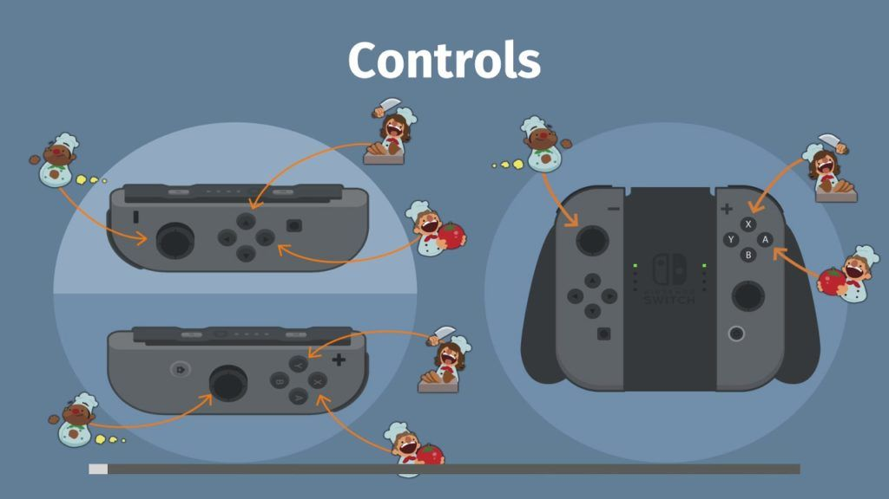
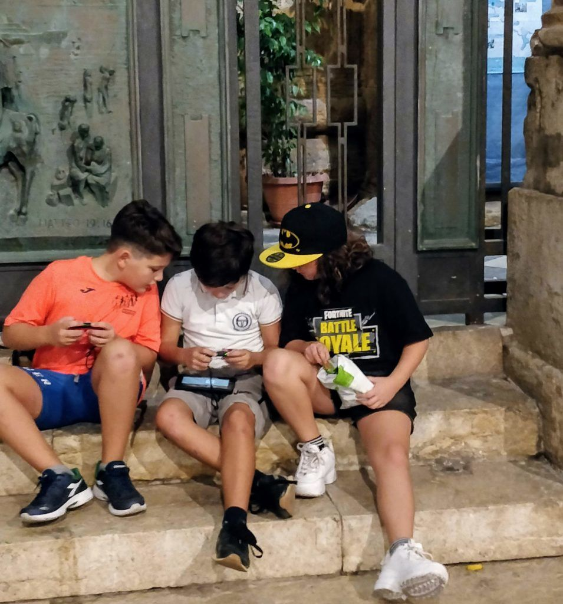

For my 6th birthday, my mom gave me an Optimus Prime robot that walked and made sounds. It was such an amazing present and I was so surprised by it that I remember falling on my back when I opened the box. I was always one for the dramatic.

Being 6 years old is awesome and as a 90s kid, I recall seeing all these crazy cool toys: remote control cars, Tamagotchis, and of course one of the finest entertainment devices of all time: the Super Nintendo Entertainment System, SNES for short.

Anyone that owned an SNES can testify for its greatness. With just a few pixels and sounds, it broke every idea of what fun was supposed to be and paved the way forward for modern consoles.

Which brings me to the present day and the most enjoyable thing I currently own: The Nintendo Switch. This is a story of how good design and engineering can make us feel like 6 years olds and bring joy to our lives.

As an engineer, I'm a big fan of good user experience and I love things that work as you expect them to work. We all evolved to _feel_ things and make _intuitive_ sense of the world. If we see a stick or a rock we know what we can use them for. We can intuitively understand a tool's purpose. In the modern world, however, we're surrounded by devices that do crazy things in nonintuitive ways.

Whenever I pick up a new smart TV remote, I stare at it in confusion, why are there only 3 buttons? What do they even do? I've struggled many times to execute the basic functionalities of a TV due to poor design: turn it on/off, control the volume, select the input channel. Cooler design doesn't mean better design.

That's not the case with the Switch, every part of it feels intuitive, you can understand its purpose and how to use it correctly. Regardless of whether you're playing alone, on the TV, or using the Joycons (the controllers) for two people, it all somehow makes sense.

The Joycons are a masterpiece of engineering. Being able to "attach" them to the Switch's screen to play as a one-piece-device, use them together as a single controller or give one of them to someone else as a mini but fully functional controller is mindblowing. When was the last time you saw device that could _physically_ be used for more than one purpose?

It's easy to forget our world is physical rather than digital. Our phones can do so much but they're a black-box of circuits. Same for your laptop, camera and even some watches. Everything is _a single thing_ that magically does _many things_. The Switch can be _many things_ while being a cohesive unit, intuitive and most importantly: _fun._

Overcooked loading screen shows you the multiple ways you can play with. This ignored the "controllers connected to the switch" layout.

I've played video games since my first SNES when I was about 4 years old, but games get old rather quickly. Having the ability to connect the Switch to the TV and play or take it out, connect the Joycons to it with the incredibly satisfying "click" sound they make and play on the bus, give a Joycon to my daughter and play together, never gets old_._ It's a satisfying experience in between jumping, slashing, racing and exploring digital worlds. These interactions trigger the oldest most basic part of my brain that craves connection with the real world.

I can only imagine the amount of genius, design, redesign, and testing that was necessary to create such an elegant yet simple piece of engineering. I love it and I wish there were more such devices out there that focused as much on what users can be done with them in the real world as in the digital one.

Three boys playing on a single switch in the street
