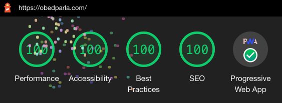

Back in 2014, I had the incredible idea of starting a blog. At the time I never
imagined I'd write over 130 articles in 5 years. My blog has become part of my
identity and a part I'm quite proud of.

My web development experience in 2014 was limited. I had only written a few
university assignments in C++ or PHP, so I decided to go for something simple
and powerful: WordPress.

But now as an experienced web dev, I started to feel WordPress was slowing me
down. I wanted a personal site, blog, and portfolio all in one. Somewhere I
could show my open source projects as much as my articles and anything in
between. So I decided to rewrite the whole thing to suit my needs.

## The requirements

- **It must use React:** It's just great.
- **Incredibly fast:** I'm a performance geek and fast websites are great. I
  spent a lot of time optimizing my WordPress site and didn't want to sacrifice
  performance.
- **Fun to develop and write on:** Writing and publishing in WordPress are easy,
  but developing for it isn't that much fun. I wanted something JavaScript
  based.
- **Low maintenance required and low cost:** WordPress hosting is cheap but I
  wanted cheaper.

This list is the holy grail of websites: fast, fun to develop and cheap to
maintain, what could tick all the boxes?


### The perfect match: Gatsby

Gatsby is a static site generator that makes creating a static website using
React and Node a breeze.

The difference between **static** and **dynamic** sites is that the former will
serve files that have already been created (you _build_ the website once) while
dynamic sites will create them "on the run". Delivering static files will
_always_ be faster than creating dynamic ones. Having a fully static site has
limitations such as serving different data to different users, but for my use
case, static was perfect.

Gatsby also met all my requirements: it's React-based, it's incredibly fast out
of the box, it's fun to develop, and hosting static files is free or very cheap.
Something I also liked is that Gatsby aims to do only one thing: generate static
sites. Tools aiming to do one thing tend to excel at it, and Gatsby certainly
does.

My favorite advantages of using Gatsby are:

- **Incredible image optimization like nothing you've ever seen:** You can save
  a 30mb image and Gatsby will transform it into a hyper-optimized 300kb one.
- **Easy to update:** Platforms such as Netlify will deploy your site on every
  git push, it's super convenient. You can even have subdomains or previews for
  different branches.
- **Speed and reliability:** Gatsby sites are _fast_ and you can serve static
  files over a CDN, which guarantees global speed and availability.
- **No errors:** since all pages are generated at build time, your site won't
  crash due to bugs. If it builds, it works!
- **Plug-and-play:** there are
  [over 1500 plugins](https://www.gatsbyjs.org/plugins/) to make your life
  easier, from Google Analytics to offline support and SEO.
- **It's all JavaScript:** having an error? A plugin misbehaving? Want to submit
  a PR to Gatsby's core? Since everything is in JS you can be part of the
  community. Gatsby has fantastic documentation too.

## Migrating to Gatsby from 5 years of WordPress

I've written all my articles in WordPress since 2014 and I wanted all 130+ of
them in my new blog. It was easier than I thought it would be.

Here's how:

### Using WordPress data in Gatsby

I thought this was going to be the most challenging part. I needed a way to use
all articles living in WordPress in Gatsby. However, Gatsby makes it effortless
to use data from popular platforms. By using a "source plugin" Gatsby
automatically populates its Graphql store and gives you access to all your
information. You can create or modify your own source plugins as well, if your
platform of use doesn't have a source plugin (and make it open source!).

Graphql is a new way to get data from APIs, very different from the good old
REST API. It's also an integral part of Gatsby as it was designed to be used
with it. Although you can bypass Graphql entirely, it's strongly discouraged as
you won't have access to some powerful features.

After tinkering with the idea of keeping my articles in WordPress I decided to
move everything into Markdown instead. It would make developing easier and I
would completely rid myself of WordPress. Markdown (**.md** files) allows you to
write plain text and it's easy to transform into HTML. This article and all of
Github's **README**s are written in Markup, for example.

Markdown makes writing more enjoyable as I don't have to worry about HTML
anymore, and the **.md** files will live alongside the site's code on Github and
be version controlled! They also allowed me to use
[Gatsby Advanced Started](https://github.com/Vagr9K/gatsby-advanced-starter)
(GAS from now on), a project that aims to provide a minimal base for building
SEO centric Gatsby websites. No one wants to reinvent the wheel and GAS helps
you focus on developing your site and not the boring parts.

### How to transform WordPress posts into Markdown

After exporting all articles from WordPress I had to transform them into
Markdown. The best way to do this is with a tool, which you can find here:
[WordPress Export To Markdown](https://github.com/obedparla/wordpress-export-to-markdown).
I fined tuned it to extract all the content, categories, tags and other
important information. It will also extract all of your post's images.

Add the **export.xml** you got from WordPress to the tool above and run:

```bash
 node index.js --postfolders=false --prefixdate=true
```

You can then move the files into your project's **content** folder, start Gatsby
and you'll see a minimal representation of your articles. Now it's time to build
your new site!

### Creating posts and pages with Gatsby

Gatsby uses "PHP like" routing, where each React component placed under the
**pages** folder will automatically become a page in your site. Use this for
one-time pages such as "about me" and "index".

For dynamic content such as posts or categories, you can create **templates**
which Gatsby uses to create specific pages at build time. If you're using GAS
these templates already exist for **posts**, **categories** and **tags**.
Reading through them is a good way to understand how to create dynamic content
in Gatsby. You can modify any template or page and Gatsby will show the changes
instantly in your browser, an important feature for fast iteration.

The heart of Gatsby is in the **gatsby-node.js** file, where you specify the
page's or template's behavior: its slug, component to be used, and any extra
data you want to use. This file is also where you can populate your **nodes**,
which represent data in your GraphQL store. With GAS this is are already taken
care of though, all you'll need is to understand
[the basics of GraphQL](https://www.gatsbyjs.org/docs/GraphQL-concepts/) in
order to use that data in your components.

[This site's source code](https://github.com/obedparla/obedparla.com) is open,
so feel free to check it out.

## Designing and styling your Gatsby site

When it comes to writing your styles
[Gatsby supports many styling options](<(https://www.gatsbyjs.org/docs/styling/)>):
good old **.css** files, Sass, CSS-in-JS, you name it.

This site has a simple, minimalistic design, yet I spent the majority of my time
in designing it. The final product took many iterations. Both because I wasn't
sure of what I was aiming for, and because designing takes a long time.

Here are some tips to help you If you're doing the site's design yourself:

- **Good design is often inspired by good design:** you've heard it before,
  "good artists copy, great artists steal". Look at websites you like, see what
  you find pleasing about it and then add your personality to it.
- **Decide what's the theme and purpose of your site:** is it minimalist and
  simple? Colorful? Impactful? Do you want to highlight your writing, your
  projects, your design skills? Each choice will give you different results.
- **Use available resources:** there are fantastic design systems that you can
  use when creating a site. Doing everything from scratch is not always
  necessary. Some of them are [MaterialUI](https://material-ui.com/),
  [Ant](https://ant.design/) or [Materialize](https://materializecss.com/).

## Deploying it!

A major advantage of using a static website is that deploying it is the easiest
and cheapest process you'll ever have.

I'm using [Netlify](https://www.netlify.com/) to deploy this site. It's fast,
easy and _free_, but there are myriad other platforms you can use: Surge, Now,
Heroku, AWS Amplify.
[You can find an extensive list of platforms in the Gatsby site](https://www.gatsbyjs.org/docs/deploying-and-hosting/).

## Optimizing it!

With Gatsby, your site will be faster than the default WordPress install out of
the box, but you can improve it to make it even faster, more accessible and SEO
friendly.

A great tool for optimizing any website is
[Lighthouse](https://github.com/GoogleChrome/lighthouse). It does "automated
auditing, performance metrics, and best practices for the web". It not only
highlights areas for improvement but gives detailed information and links to
learn more about the topics. A big part of my web performance knowledge comes
from following Lighthouse's links and investigating more.

**How to run a Lighthouse audit:**

- **With Chrome:** open up dev tools and then open the **Audits** tab. You can
  use the default options for now and click on **Run audits**.

- **With Firefox:** you can use
  [an extension to add Lighthouse to Firefox](https://addons.mozilla.org/fr/firefox/addon/lighthouse-report-generator/)
  and follow the extension's guidance.
- Using the
  [Lighthouse CLI](https://github.com/GoogleChrome/lighthouse#using-the-node-cli)
  is a third option.

Once you have your report, you will likely see many potential improvements.
Don't let the score scare you, getting to 100 points with Gatsby it's much
simpler than it is in order platforms due the advantages I've mentioned before.



### Keeping your Gatsby site _fast_

Speed is paramount on the internet. Users have come to expect fast-loading
websites and even Google takes it into account for rankings. Gatsby sites are
incredibly fast, but you need to follow some good practices to keep it that way:

- **All data in Gatsby should go through GraphQL or the page's context:** This
  allows Gatsby to render the pages statically, the way it works is that Gatsby
  is fetching and generating all data in Node during build time. This means you
  should avoid requesting data clientside (in your **useEffect** or
  **componentDidMount** for example) as they can slow down the page and prevent
  it from being static.
- **Be careful with using heavy libraries:** To benefit from React and improve
  the UX, Gatsby sends JS to the client, which means importing and using a heavy
  library such as **moment.js** in your components will make your app load
  slower. An easy way to avoid this pitfall is to think of your pages as
  client-side rather than server-side rendered.
- **Let the server do the hard work:** Using the example above, if you need to
  modify dates with **moment** do it in **gatsby-node.js** and send that data as
  props to your pages rather than importing it directly in your components.
- **Use less data:** GraphQL makes it easy to get _only_ the data you need, but
  it's also simple to get too much of it by mistake. An example is being able to
  get every single article for an infinite-scrolling blog. Make sure the data
  you get is the data you need.

### Accessibility (a11y)

Not all users visiting your website will interact with it the way you do. Some
users could be blind, not use a mouse, or be impaired in some other way. Good
a11y will help them make sense of your site, and as a bonus, it leads to better
HTML and higher SEO scores, plus it's the right thing to do.

You can follow Lighthouse's recommendations and
[use a tool such as Axe](https://chrome.google.com/webstore/detail/axe-web-accessibility-tes/lhdoppojpmngadmnindnejefpokejbdd)
to help you fix a11y issues. As a bonus point, you'll learn a lot in the
process.

### SEO

Search Engine Optimization is big business and a complicated topic, but a good
way to understand the basics is to imagine that search engines (which means
Google) like the following:

- Great content
- In fast websites
- Easily accessible to users
- That shows up in other parts of the internet
- And follow certain guidelines


There are tools to help you with SEO but since Google doesn't fully disclose
what they rank for, they're closer to guidelines and good practices than
rock-solid advice. Following Lighthouse feedback is a good place to start and
GAS takes care of the basics by adding metadata to your pages such as the
**title** and **description**.

If you've heard that "React is not good for SEO", worry not! What _could_ be bad
for SEO is client-side-rendered apps, since Google might not be able to read
your content, but with Gatsby all content is static, letting Google see it and
crawl it.

## Final words

Since you've read all the way here I hope you've learned something and found
this article helpful! Discuss this, or anything else with me
[@obedparla](https://twitter.com/obedparla).
