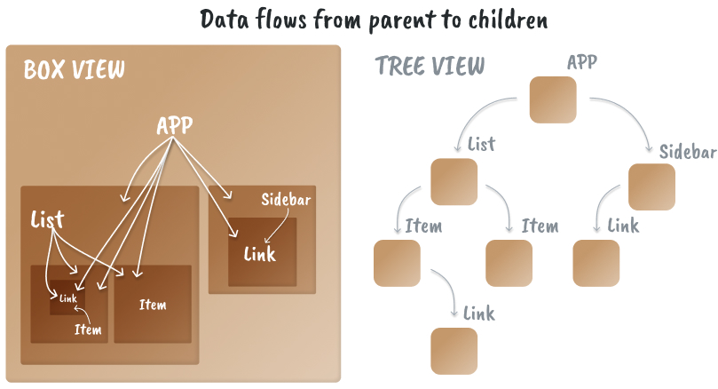
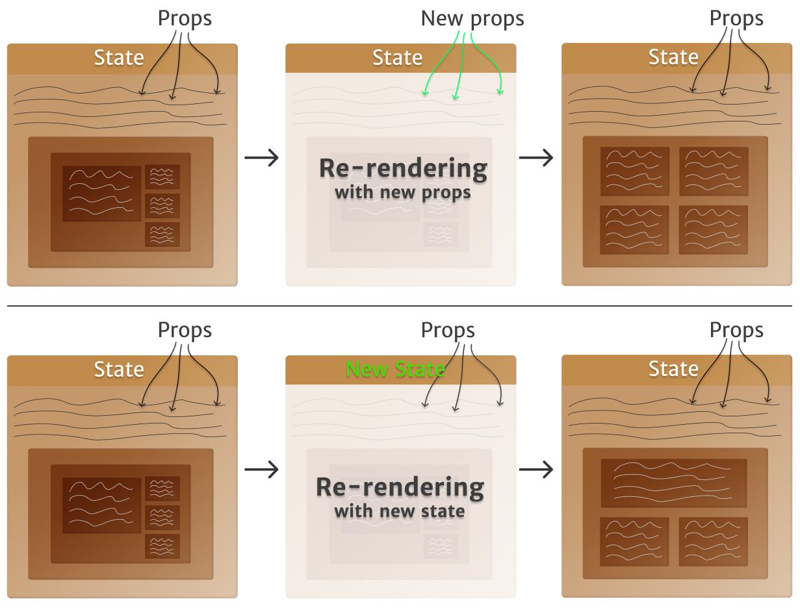

I've learned that the biggest difference between someone that has mastered a
language, framework or tool and someone who hasn't lies in the _mental models_
they use. One person will have a clear and advanced one and the other will not.

By having a good mental model you can intuitively understand complex problems
and device solutions much faster than if you had to find a solution with a
step-by-step process.

I work with React every day and I'm constantly finding solutions to challenging
problems. I can do that by having good mental models around React. In this
article I will explain those mental models that help me solve problems and tame
complexity.

> Whether you've been working with React for years or are just starting, having
> a useful mental model is, in my opinion, the fastest way to feel confident
> working with it.

## What's a mental model?

A mental model is how we imagine a system to work. We create one by
understanding different parts of the system and its connections, and it's
important because it helps us make sense of the world and helps us solve
problems.


A good example of a mental model is the internet: it's a complex system with
many interconnected parts, but think about the way you imagine it to work. I
imagine it as many computers connected to each other through many big servers,
with many middle men redirecting where each piece of information is stored.

That's of course an incomplete mental model but it's good enough that I can work
with it, solve problems with it, and improve it if I ever need to, and that's
the gist of it: Mental models are meant to help us solve problems and understand
the world.

## Why are mental models important?

When I started building websites in 2014 I had a hard time understanding how it
all worked. Building my blog with WordPress was easy, but I had no idea about
hosting, servers, DNS, certificates, and much more.

As I read articles and tried stuff out (and broke my server config more than
once) I started to grasp the system, to get glimpses into how it all worked,
until eventually it "clicked" and I felt comfortable working with it. My mind
had built a mental model around this system that I could use to work with it.

If someone had explained it, transfered their mental model to me, I would've
understood it much faster. Here I'll explain (and show) the mental models I use
with React. It will help you understand React better and make you a better
developer.

## React Mental Models

React helps us build complex, interactive UIs more easily than ever before. It
also encourages us to write code in a certain way, guiding us to create apps
that are simpler to navigate and understand.


React itself is a mental model with a simple idea at its core: encapsulate
portions of your app that rely on similar logic and UI and React will make sure
that portion is always up kept up to date.

Whether you've been working with React for years or are just starting, having a
clear mental model is the best way to feel confident working with it. So for me
to transfer my mental models to you I'll start from first-principles and build
on top of them.

## It's functions all the way down

Let's start by modeling the basic building blocks of JavaScript and React:
functions.

- A React component is just a function
- Components containing other components are functions calling other functions
- Props are the function's arguments

This is hidden away by JSX, the markup language React uses. Strip away JSX and
React is a bunch of functions calling one another. JSX is in itself an applied
mental model that makes using React simpler and more intuitive.

Let's look at each part individually.

### A component is a function that returns JSX

React is used with JSX—JavaScript XML—a way to write what seems as HTML with all
of JavaScript's power. JSX offers a great applied mental model for using nested
functions in a way that feels intuitive.

Let's ignore class components and focus on the far more common functional
components. A _functional_ component is a function that behaves exactly like any
other JavaScript function. React components always return JSX which is then
executed and turned into HTML.

This is what simple JSX looks like:

```jsx
const Li = props => <li {...props}>{props.children}</li>;

export const RickRoll = () => (
  <div>
    <div className='wrapper'>
      <ul>
        <Li color={'red'}>Never give you up</Li>
      </ul>
    </div>
  </div>
);
```

Which compiled into pure JavaScript by Babel:

```javascript
const Li = props => React.createElement('li', props, props.children);

export const RickRoll = () =>
  React.createElement(
    'div',
    null,
    React.createElement(
      'div',
      {
        className: 'wrapper',
      },
      React.createElement(
        'ul',
        null,
        React.createElement(
          Li,
          {
            color: 'red',
          },
          'Never give you up',
        ),
      ),
    ),
  );
```

If you find this code difficult to follow you're not alone, and you will
understand why the React team decided to use JSX instead.

Now, notice how each component is a function calling another function, and each
new component is the third argument for the `React.createElement` function.
Whenever you write a component, it's useful to keep in mind that it's a normal
JavaScript function.

An important feature of React is that a component can have many children but
only one parent. I found this a confusing until I realized it's the same logic
HTML has, where each element must be inside other elements and can have many
children. You can notice this in the code above, where there's only one parent
`div` containing all the children.

### component's props are the same as a function's arguments

When using a function we can use arguments to share information with that
function. For React components we call these arguments `props` (funny story, I
didn't realize props is short for _properties_ for a long time).

Under the hood props behave _exactly_ like function arguments, the differences
are that we interact with them through the nicer interface of JSX, and that
React gives extra functionality to props such as `children`.

## Creating a mental model around functions

Using this knowledge let's craft a mental model to intuitively understand
functions!

When I think about a function I imagine it as a box, and that box will do
something whenever it's called. It could return a value or not:

```javascript
function sum(a, b) {
  return a + b;
}

console.log(sum(10, 20)); // 30

function logSum(a, b) {
  console.log(a + b); // 30
}
```

Since a component is a fancy function, that makes a component a box as well,
with `props` as the ingredients the box needs to create the output.


When a component is executed it will run whatever logic it has, if any, and
evaluate its JSX. Any tags will become HTML and any component will be executed,
and the process is repeated until reaching the last component in the chain of
children.

Since a component can have many children but only one parent I imagine multiple
components as a set of boxes, one inside another . Each box must be contained
within a bigger box and can have many smaller boxes inside.


But the mental model of a box representing a component is not complete without
understanding how it can interact with other boxes.

## How To Think About Closures

Closures are a core concept in JavaScript. They enable complex functionality in
the language, they're super important to understand in order to have a good
mental model around React.

They're also one of the features newcomers struggle with the most, so instead of
explaining the technicalities I'll demonstrate the mental model I have around
closures.

The basic description of a closure is that it's a function. I imagine it as a
box that keeps what's inside of it from spilling out, while allowing the things
outside of it from entering, like a semi-permeable box. But spilling out where?

While the closure itself is a box, any closure will be inside bigger boxes, with
the outermost box being the Window object.


### But what _is_ a closure?

A closure is a feature of JavaScript functions. If you're using a function,
you're using a closure.

As I've mentioned, a function is a box and that makes a closure a box too.
Considering that each function can contain many others inside of it, then the
closure is ability of a function to use the information outside of it, while
keeping the information it has inside from "spilling out", or being used by the
outer function.

Speaking in terms of my mental model: I imagine the functions as boxes within
boxes, and each smaller box can see the information of the outer box, or parent,
but the big box cannot see the smaller one's information. That's as simple and
accurate an explanation of closures as I can make.



Closures are important because they can be exploited to create some powerful
mechanics and React takes full advantage of this.

### Closures in React

Each React component is also a closure. Within components you can only pass
props down from parent to child and the parent cannot see what's inside the
child, this is an intended feature to make our app's data flow simpler to trace.
In order to find where data comes from, we usually need to go up the tree to
find which parent is sending it down.

A great example of closures in React is updating a parent's state through a
child component. You've probably done this without realizing you were messing
around with closures.

To start, we know the parent can't access the child's information directly, but
the child can access the parent's. So we send down that info from parent to
child through `props`. In this case, the information takes the shape of a
function that updates the parent's state.

```javascript
const Parent = () => {
  const [count, setCount] = useState(0);

  return (
    <div>
      The count is {count}
      <div>
        <ChildButtons onClick={setCount} count={count} />
      </div>
    </div>
  );
};

const ChildButtons = props => (
  <div>
    <button onClick={() => props.onClick(props.count + 1)}>
      Increase count
    </button>
    <button onClick={() => props.onClick(props.count - 1)}>
      Decrease count
    </button>
  </div>
);
```

When an `onClick` happens in a `button`, that will execute the function received
from props `props.onClick`, and update the value using `props.count`.

The insight here lies in the way we're updating a parent's state through a
child, in this case the `props.onClick` function. The reason this works is
because the function was _declared_ within the `Parent` component's scope,
within its closure, so it will have access to the parent's information. Once
that function is called in a child, it still lives in same closure.

This can be hard to grasp, so the way I imagine it is as a "tunnel" between
closures. Each has its own scope, but we can create a way-one communication
tunnel that connects both.

Once we understand how closures affect our components, we can take the next big
step: React state.

## Fitting React's State Into Our Mental Model

React's philosophy is simple: it handles _when_ and _how_ to render elements,
and developers control the _what_ to render. State is our tool to decide that
what.

When state changes, its component renders and therefore re-executes all the code
within. We do this to show new, updated information to the user.

In my mental model state is like an especial property inside the box. It's
independent of everything else that happens within it. It will get a default
value on the first render and always be up to date with the latest value.

Each variable and function is created on every render, which means their values
are also brand new. Even if a variable's value never changes, it is recalculated
and reassigned every time. That's not the case with state, it only changes when
there's a request for it to change via a `set` state event.


State follows a simple rule: Whenever it changes it will re-rendered the
component and its children. Props follow the same logic, if a prop changes, the
component will re-render, however, we can control state by modifying it, props
are more static and usually change as a reaction to a state change.

## The Rendering Mental Model: understanding React's magic

I consider rendering to be React's most confusing part because a lot of things
happen during rendering that sometimes isn't obvious by looking at the code.
That's why having a clear mental model helps.

The way I imagine rendering with my imaginary boxes is two-fold: the first
render brings the box into existence, that's when the state is initialized. The
second part is when it re-renders, that's the box being recycled, most of it is
brand new but some important elements of it remain namely state.

On every render everything inside a component is created, including variables
and functions, that's why we can have variables storing a calculation's results,
since they will be recalculated on the every render. It's also why functions are
not reliable as values, due to their reference (the function's value, per se)
being different every render.

```javascript
const Thumbnail = props => (
  <div>
    {props.withIcon && <AmazingIcon />}
    
  </div>
);
```

The above will give a different result depending on the props the component
receives. The reason React _must_ re-render on every prop change is because it
wants to keep the user up to date with the latest information.

However, the state doesn't change on re-renders, it's value is maintained.
That's why the box is "recycled" instead of created brand new every time.
Internally, React is keeping track of each box and making sure its state is
always consistent. That's how React knows when to update a component.

 changes, a new render happens and the component's output can change")

By imagining a box being recycled I can understand what's going on inside of it.
For simple components, it's easy to grasp, but the more complex a component
becomes, the more props it receives, the more state it maintains, the more
useful a clear mental model becomes.

## A complete React mental model: Putting it all together.

Now that I've explained all the different parts of the puzzle separately, let's
put it all together. Here's the complete mental model I use for React
components, directly translated from how I imagine them into words.

I imagine a React component as a box that contains all of its information within
its walls, including its children, which are more boxes.

And like a box in the real world, it can have other boxes inside of it and these
boxes can, in turn, contain more boxes. That way each box/component must have a
single parent, and a parent can have many children.


The boxes are semi-permeable, meaning they never leak anything to the outside
but can use information from the outside like if it belonged to them. I imagine
like this to represent how closures works in JavaScript.

In React the way to share information between components is called `props`, the
same idea applies to function and then it's called `arguments`, they both work
in the same way but with a different syntax.

Within components, information can only travel _down_ from parents to children.
In other words, children can access their parent's data and state, but not the
other way around, and the way we share that information is through `props`.

I imagine this directional sharing of information as boxes within boxes. With
the inner-most box being able to absorb the parent's data.


The box must first be created though, and this happens on `render`, where the
default value is given to `state` and just like with functions, all the code
within the component is executed. In my mental model, this is equivalent to the
box being _created_.

Subsequent renders, or `rerenders`, execute all the code in the component again,
recalculating variables, recreating functions and so on. Everything except for
`state` is brand new on each render. State's value is maintained across renders
is updated only through a `set` method.

In my mental model, I see re-rendering as recycling the box since most of it is
recreated, but it's still the same box due to React keeping track of the
component's state.

When a box is recycled all the boxes within it, its children, are also recycled.
This can happen because the component's state was modified or a prop changed.



Remember that a state or prop changing means the information the user sees is
outdated, and React always wants to keep the UI updated so it rerenders the
component that must show the new data.

By using these mental models I feel confident when working with React. They help
me visualize what can be a maze of code into a comprehensive mental map. It also
demystifies React and brings it to a level I'm much more comfortable with.

React is not that complex once you start understanding the core principles
behind it and create some ways to imagine how your code works.

---

I hope this article was useful to you and it was as enjoyable to read as it was
to write! I realized that I understand React intuitively and putting that
understanding into words was challenging.

Some of the explanations given in this article are simplifications, for example
more things are not re-executed on every render such as the useEffect,
useCallback, and useMemo hooks. My complete mental model is more complex than I
could explain in a single article, to stay tuned for PART 2 and 3.

Part 2 will focus on an in-depth model of React's API, such as useMemo,
useCallback and useEffect as well as how to use a mental model to improve your
React app's performance. Part 3 will focus on high-level features such as
Context and a summary of the exact and complete mental model I use for React.

If you'd like to read the next 2 parts consider subscribing to my newsletter, I
only email for new articles and will never spam you.
