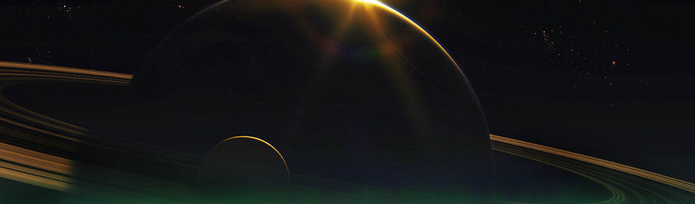

* * *

Suenas como aquella vieja canción de la que nadie recuerda la letra, pero todos tararean.

Suenas como aquel familiar sonido que extrañamos en nuestros oídos y no sabemos replicar.

Suenas como un peculiar roce de cuerpos en un intrincado abrazo lleno de amor y fugitivo del tiempo.

Como un Click en tu memoria que te trae los mejores recuerdos que no recordabas.

Como dos piezas uniéndose para formar el mas espléndido espectáculo de luces y ritmos extraordinarios.

Como una epifanía que nadie más puede escuchar, y que no conoces la fuente pero sonríes por su elegancia.

Porque suenas como todo lo que no podemos escuchar y aún así se nos eriza la piel, se nos acelera el corazón, adrenalina a montón y pupilas dilatadas.

Porque suenas como una gran verdad cayendo del cielo y que jamás tuviste las agallas de levantar la mirada.

Oh, porque no suenas como a nada que conozcamos, pero aún así llenas nuestros sentidos, sin razón ni lógica, sin falta y aún así no sabemos esperarte.

* * *
