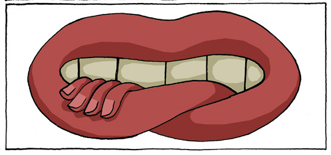

##### Ese momento en el que piensas _"bueno, es mejor que nada_", porque obtuviste una calificación "decente", porque compraste un producto parecido al que deseabas, porque la oferta es peor de lo que esperabas, **pero**... _"Es mejor que nada"._

El conformismo mata, puede que no salga de titular en el periódico, **ni de titular ni de nada**, pero mata la esperanza, mata las ganas de vivir, de luchar, mata esa llama que nos hace humanos, la extingue mejor que cualquier aguacero y si es cierto que podemos culpar a muchas cosas por ser conformistas, **al final depende solo de nosotros.**

He llegado a ver que el conformismo es posiblemente uno de los asesinos más silenciosos y menos perseguidos, porque he visto como **ha logrado acabar un país entero**, en donde las colas infinitas llegan a convertirse en centros sociales con sillas y domino incluido, las apuestas están de más. Las risas en medio del pesar porque _"No queda de otra, al mal tiempo buena cara"_, **¡No!**, si llueve busca un paraguas, no hay árbol que no te resguarde ni techo que corra de ti.

**No todo se puede evita**r, algunas cosas se deben aceptar y vivir con ello, superarlo simplemente. **Pero eso no nos hace conformistas**, nos hace sabios y facilita la vida. Conformista aquel que a pesar de conocer algo mejor y a pesar de saber que lo puede obtener, continúa diciendo _"Esto es mejor que nada"_ y toma lo que tenga al alcance de la mano sin considerar que, sólo a unos pasos de distancia encontrará lo que realmente busca.

El conformismo ya se ha convertido en una enfermedad en las mentes y cuerpos de millones de personas en este país. Y me niego a pensar que es sólo la naturaleza humana, insisto en culpar la sociedad sin sentido en la que vivimos y de la que formamos parte, en la que los pocos que luchan terminan dándose por vencidos ya que _"Las cosas podrían estar peor"._

**Siempre puede estar peor,** siempre**. Y siempre puede estar mejor.** Conformista aquel que mira lo malo y sonríe porque **no es tan malo** como podría ser. En vez de hacer algo al respecto por que simplemente sea mejor.

No me malentiendan, amargarse porque no todo funciona a la perfección tampoco es muy útil. Pero las cosas están tan fuera de balance, que ya la balanza se rompió, y hace mucho...

Conformista aquel que espera que las cosas mejoren por si solas, mientras mira la decadente vida que lleva, entendiendo que hace mucho perdió las riendas de su propia comodidad pero que se sigue repitiéndose así mismo _**"Aquí las cosas no funcionan, pero aún se puede vivir".**_
