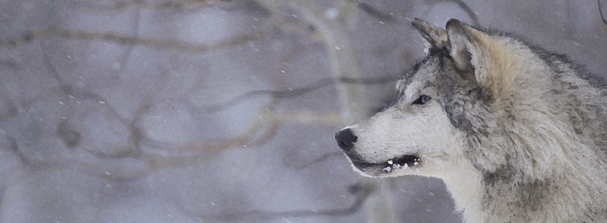
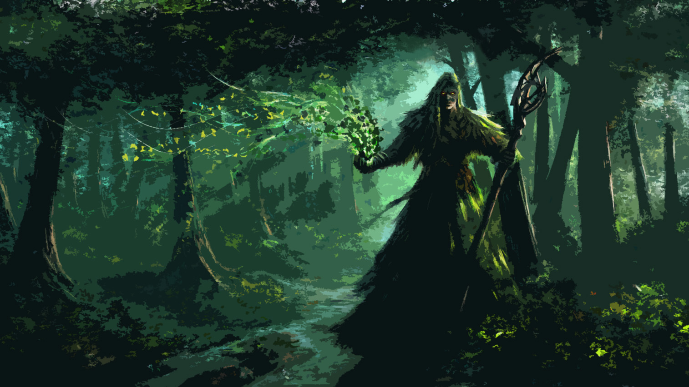
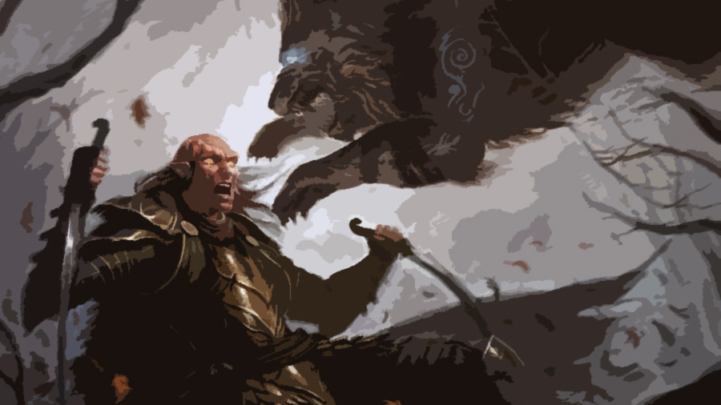

The wolf approached the man as it usually did, appearing out of nowhere after sensing his presence from far away, seeing the man walk towards him, appearing lost and somewhat weak. He approached trying to appear as docile as an alpha wolf could ever be.

The man was tall with bushy dark hair, thick eyebrows and strong looking jaw. He seemed strong compared to most of the humans the wolf had seen.

The wolf was an astonishing creature. As big as a horse, with grey fluff, white and strong teeth that looked like small and perfectly aligned knives, blue eyes that showed kindness and wisdom despite being part of such an impressive and frightening creature. It walked silently despite crushing the bed of sticks that was the forest's ground with the confidence such strength provided.

The human looked at him approach, with his most-of-the-time green eyes. "Good, it wasn't that time yet" though the awaiting beast. The human closed the gap between the two, understanding that such an animal would never walk all the way to him but simply announce it's presence to the human, it was an _alpha wolf_ after all, intimidating as only such creature could be.

The human extended his right hand as much as he dared to, waiting for the wolf to provide his approval. After getting some of his essence through his nostrils, evaluating the situation, smelling the blood that was surging from the human's other arm the wolf approved. He closed the small gap yet left between them.

What had happened to the man in his absence? The strong instinct of the wolf told him that the human had been caught, they found out about his qualities. He knew it by nature, just as he knew what was going to happen soon.

The man walked towards the nearest tree and dropped himself into his legs, resting his back against the tree's trunk giving up the attempt to show strength in the absence of it, the job had been done, here he was in front of the ancient creature at last. The wolf saw this as a sign of tiredness and defeat, the human wasn't _that_ special after all, he could bleed like any other, _almost_ like any other.

The wolf had seen this sign in other weaker wolves as well, what a shame it was when they welcomed their own deaths. Weakness was its worst enemy and here it was, the strongest of humans simply falling because of some blood being spilled. Shamelessly giving up for rest.

But as the wolf examined the human closer, it realized that it was much more blood that he had realized at first. His nose was getting full of it, the human was lucky the wolf was there, no animal would dare come close to this particular prey in his presence.

Following the blood path left behind by the weakened human, the wolf realized what had really happened. The man intelligently started to shape himself to confuse any followers and camouflage his essence. Apparently the man could even shape his blood and his aroma. That was surprising if not simply amazing. It would surely confuse any animal or human device. "Well done" thought the wolf. Even himself was tricked by it for a moment, he who knew the human's tricks. Although apparently not at all of them.

It would be interesting once they merged. It would be a good thing. That, only if the human didn't end up blasting himself up before even starting.

An unnatural thing surely, but a wolf that had been part of hundreds of packs through the centuries was unnatural itself.

He had seen them die slowly, their own kind, as humans started to use this abomination, this magic... Explosions that it seemed they could control with strange devices. Their kind had no chance surviving this slaughter, they bleed, they died, they were nothing but common wolves. He missed them nevertheless. Such a long time since the wolf had had any real pack of his own. Such a long time since he decided it was safer for them all to live without him leading them. Better leaderless than dead.

The wolf had been feared, chased and even idolized. Now it was almost just like any other wolf. Weak. Unable to claim what was his.

But that would soon change.

The human pet him in the head. What was this? Affection, maybe? They might as well be from the same pack now. The wolf just wondered who was the alpha, the human, who seemed to be in control, or him, who could crack this weak man's throat without effort. Control was of those who had the power.

Which of the two was the powerful one? Was the wolf going to bet his immortality in vain? Was this worth it?

Or was the human the one who was going to sacrifice it all? They both knew who would come victorious out of the essence's trial. The battle could be won only by one of them. There was no doubt of it, a human, even this _notorious_ human would never defeat an _alpha_ being, they were the strongest, most determined and stubborn animals, with the will to move mountains, and he was the alpha of the alphas.

Not because they hadn't tried to subdue him. Oh, they had tried, insolent beings, thinking of themselves as master of creatures. Thinking that only because they had discovered the secrets of nature they were allowed to conquer other creatures. They deserved what had happened to them.

He couldn't complain, each time a druid had challenged the wolf, they had miserably failed, they had given him part of their own essences, making him even stronger, wiser, more complete, connected with nature in new ways he thought impossible before finding out the connection the druids had with the world around them.

\[caption id="attachment\_1708" align="alignleft" width="1514"\] By [Edli](http://edli.deviantart.com/art/Druid-180855410)\[/caption\]

But this time it was going to be different. This human was no druid, he was no master of the natural arts long forgotten. And the human was not going to start the trial, it was time for the wolf to be the challenger, to conquer other creature's essence by his own will, and there was no doubt in either of their minds who had the strongest will and essence.

But why was this human up for the challenge? How had he found out about such hidden and forgotten secrets in the first place? The trial should have been lost in the mists of time along with the last of the druids, only they knew the secrets of the essences, only they had the will and the knowledge to defy other creatures and win the trials, only they had defeated his offspring.

Only they paid the price for this insolence. For this... Sin. They were dammed the moment they strived for immortality. It could only be given, never taken. The wisdom of the druids was only opaqued by their greed.

Only the seemingly all-mighty, stubborn, _insolent_ druids had tried to conquer _him_. Fools.

He had enjoyed ripping their bodies apart after crushing their will in what they had started. Watching their bodies motionless, alive but empty. Their eyes filled with fear, the realization of what they had done just before losing everything. Just before giving the wolf what they had so respectfully tried to _steal_ from him.

What they had almost achieved at stealing from his little ones. He had failed at protecting them. They were not ready.

\[caption id="attachment\_1709" align="aligncenter" width="900"\] By [DaveRapoza](http://daverapoza.deviantart.com/art/Guys-Turn-into-Lions-146216493)\[/caption\]

But it was none of his business after all. If the human failed to start the trial correctly, it was his essence that was going to be lost forever, destroyed in the process, not his. It would be a shame, to waste such strange qualities. And if it happened, if somehow the human could be up for the challenge, the wolf would become and continue to be, well, possible the strongest creature on existence.

If this shapeshifter human could somehow recall the druid's ritual, then wolf and human would become one. The human would provide the qualities, the blue blood that allowed him to shift as desired. The wolf would provide his own essence as a base on which they could build, he would take over the comparable weak and soft human body, making it his own.

He would have to subdue the human's essence in the trial, to overcome the body's natural _wisdom of protection_ in order to make it his own, to crush the mind's will without giving away any weapons the man's subconscious could use against him. But nothing the damned druids hadn't taught him by mistake.

"It's almost time my friend", said the human. His voice deep, strong, no trace of fear in it, no desire neither, simply duty, as if this was nature's plan.

"I guess it was destiny for us to meet. The mighty immortal wolf of the histories of old and the anomaly, the weirdo, the guy who could change forms, the blue blood".

The wolf showed his teeth without making any sound, lowering his head, in the most non-aggressive form possible.

"Will it work? Will my soul be preserved in you?"

Soul. What a strange word to give to your essence. Preserved? Yes. It wouldn't be the same but it would be engulfed by the wolf's own essence, giving it immortality, just as it had been given to him so long ago.

The wolf patted in the earth with his pawn, as a sign of agreement.

"Good. You show them what it’s like to be us. You show them what it's like to be chased, to be wanted. I almost feel pity for what you will do with our powers. I almost feel pity for them. An immortal being perfectly connected with nature, a shapeshifter that dug the buried knowledge of the druids".

"What will the power to subdue minds, bodies and spirits do to us?"

"To us? There would be no us. There will be me." Though the wolf, looking unblinkingly to the man's eyes. The human couldn't be such a fool as to think they would share lives, could he? It was clear how the trial worked. The winner always took it all.

"You show them. Show them how nature find it's own way to strive for balance, even through unnatural beings such as us".

Just as the human finished talking, he straightened, looking strong and decisive, just as the druids had been. The wolf could see much of them in him, wisdom, determination. But where the druid's had become greedy, this man had become... Kind and.. Sad.

The shapeshifter's eyes started to change, the pupils bursting into flames. His former green eyes being fire red now.

A flood of water inundated him. They were sea blue. Trees growing inside of his eyes, life springing at immense speed as they became green again, a different shade of green, the beautiful kind of green. Nature bursting open inside of the man's eyes.

They became violet, purple, yellow, they went from one color to the other so fast only a being as the wolf could follow.

Then they became white. The pureness of the human's essence exposed at last. The man's body was motionless, every fiber of his developed muscles contracted, every nerve screaming in agony as they shouted for relieve.

His head was slightly raised, his mouth shut. He was holding it back. The essence's looking for other creatures to infect, to overcome, but waiting. Being forced to wait. What a remarkable human he was.

The wolf's respected the man for accomplishing this grandiose feat. Wolf's and man's eyes fixed into each other. His deep and wise blue eyes dived into the pureness of the human's essence, they navigated the sea of sins, memories, regrets until he found it. The source of it all.

The trial had started.

_To be continued..._

* * *

* * *

* * *

### Note from the author

I hope you enjoyed my story and if you ended up reading this, I thank you for giving my story the opportunity. Short story of me: I write. I write short stories (that I hope people love), social criticism and about things I love (as books).

The purpose of **Conexus **is to be a short story that mixes mythology (druids, shapeshifters, giant beasts) with a criticism to our society as it is now, without giving much information, how there is a ever growing rift between humans and nature.

In **Part I **I focused mostly on the meeting. Part II will be about Conexus itself (man and wolf becoming one). All through the story you will find out why both of the main characters have a deep loath for society, the reasons behind it, along with a bunch of fantastic and epic moments that I hope I'm up to the challenge of write properly.

If you like **Conexus Part I**, you can follow me on [Wordpress](https://obedmarquezp.wordpress.com/), [Twitter](https://twitter.com/ObedMarquezP) or [Medium](https://medium.com/@ObedMarquez) to get the next parts of this epic story.
