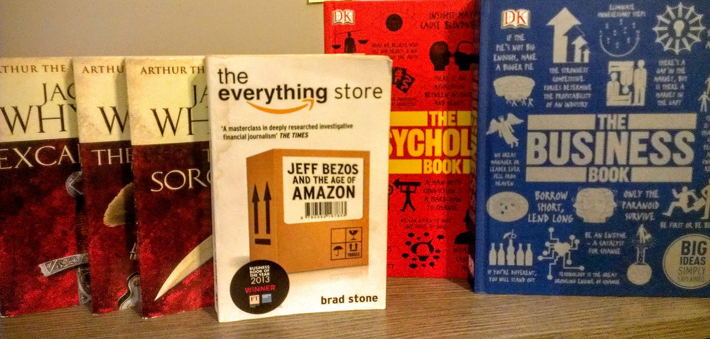
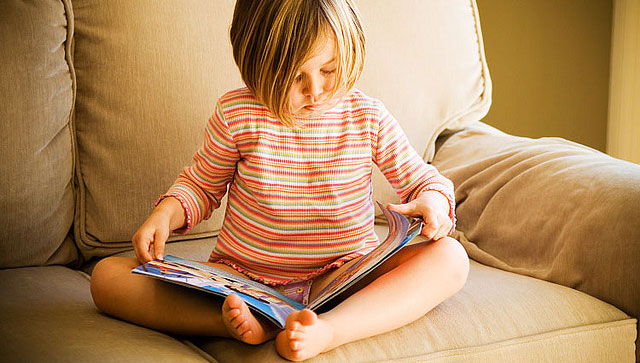
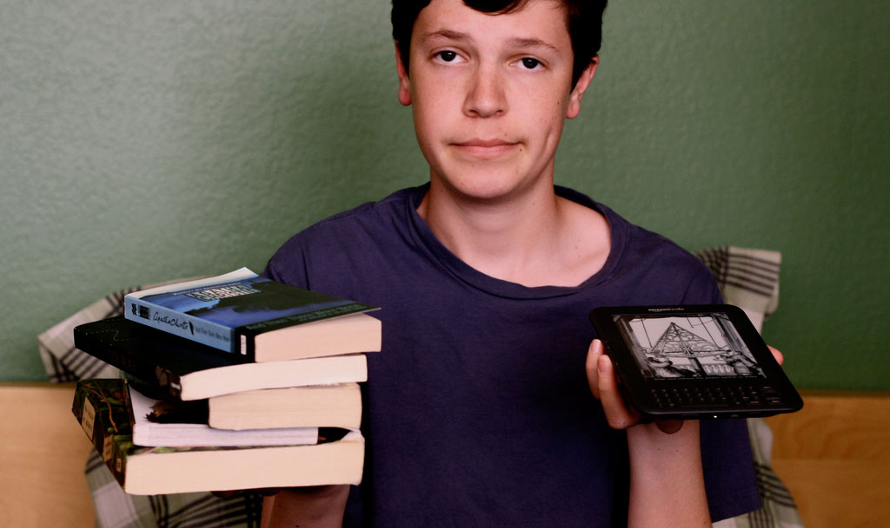
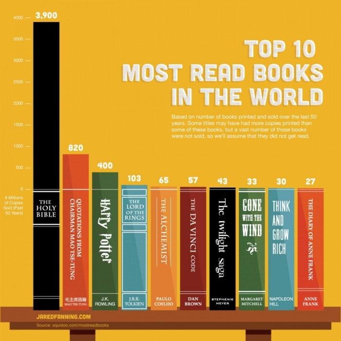
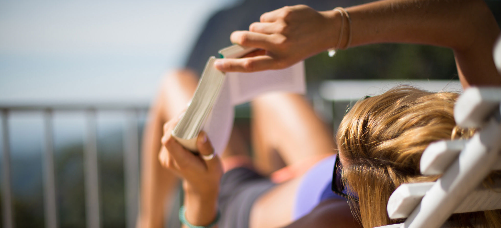
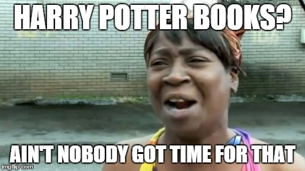

In September 2014 I went to this particular bookshop for the first time, one that I fell in love with. It is in a nice touristic street and it has an awesome name.

Merlin Library. Although I think the name should be Merlin's Library, it is a two floor small library packed with books everywhere.

What a better teacher could you wish than the mythological and wise Merlin? Oh well. I ended up buying 6 books that day.

When I bought them I thought about the time I would need to read them. It was a good investment. Maybe they would last for a few months. 4 to 6 months, based on the speed I used to read books.

I was 21 years old at the time and I had read around 60 to 70 books in my whole life. Counting from The Little Prince (as a 6th grader) to the behemoths of The Game Of Thrones series and IT by Stephen King.

Each book took me from some weeks to a few months, so it was safe to assume this 6 books should last for a few month at minimum.

I finished them in less than 2 months. Why? Because I was actually reading constantly. I didn't take a week between read and read. Every morning I was reading for an hour in bed. More on that later.

That's when I decided to start reading **one book for every week of the year.** That would translate into **52 books, **that's where the random number comes from (duh).

It was December already, so it was close to new year's resolutions just as it is now. **I'll try to convince you on what to do next year!**

I didn't wanted my new goal to die by February, as most New Year's Resolutions end up. So I looked at the whole thing from a different perspective.

I ended up reading 69 books this year (wink).

**This is how and why I did it.** And how and why you should do it too.

\[caption id="attachment\_2604" align="aligncenter" width="1676"\] The 6 original books.\[/caption\]

# How I read more than 52 books in a year and 5 ways to achieve it.

This year have been an amazing one and reading so many books made it even greater. Doing it was... well, easy, really. By now, I cannot image my life without books, when thinking on the 69 books of this year or seeing them in my [Goodreads 2015 challenge](https://www.goodreads.com/user_challenges/2207267) I get such a feeling of accomplishment. I did many things this year, but I also read a huge amount of books, I got much more smarter, geeker and I simply became a better person because of it.

Plus I went to Mars, Hogwarts, Oz, The Foundation, and Wonderland; got a sneak-peak into Apple, Google, and Pixar, moreover, I learned that the answer to Life, the Universe and Everything is **42.**

#### So here's how to read 52 books (or more) in a year, or 52 weeks, or 364 days, or...

#### You get the idea.

## 1\. Think of reading as something peculiar you can do anywhere, anytime. Don't be lazy.

Let's talk numbers.

An average person reads at 250 words per minute (W/P). An average page has from 250 to 350 words. Let's round up to reading one page in a minute and a half with each page having 350 words. This is close to the amount of words you get in any kindle book with small fonts and narrow margins/lining (the most used settings I believe).

If you read for 10 minutes, that translates into around 7 pages or 2.500 words. So, 10 minutes = 2.500 words.

If you sit down 3 to 5 times every day to read for 10 minutes, that is equal to about 30 pages a day, or 10.000 words. Then 1 day = 10.000 words.

An average book is 65 thousand words according to Amazon (not exactly true, but there is no correct answer for such a broad question). That means that if you read 10.000 words a day, sitting 4 times a day for 10 minutes each time, then by the end of the week you would have read 70.000 words.

That's a book a week. Boom! We just performed mind-boggling magic, I shall thank my lovely assistant.

BUT HOW IN PASTAFARI'S NAME WOULD I BE ABLE TO SIT 4 TIMES A DAY FOR 10 MINUTES?!

Well, that's why you're reading this, let me show you. (Plus, _really?)_

\[caption id="attachment\_2609" align="aligncenter" width="2048"\] I disliked The Girl On The Train very much. [Source](https://www.flickr.com/photos/jpstjohn/)\[/caption\]

1. If you take 30 minutes break to eat, read for 10.
2. While taking a cigarette. Take the cigarette and a book. People get 4+ cigarette breaks a day, just read two of those times.
3. Before going to sleep, 10 minutes or more.
4. In the bus. That way you don't look out of the window like silly.
5. In the a traffic jam.
6. In the bank line.
7. In any type of line.
8. Whilst letting nature do its work. Seriously, reading in the bathroom is amazing, trust me.

## 2\. Understand that you are able to do it.

Ten minutes is nothing. We use 10 minutes each time we open Facebook, scrolling down and down, you can time it. Just read a little instead!

Reading doesn't require any special skill, it's not reserved for the academics or the "smart people". We are all incredibly smart.

\[caption id="attachment\_2615" align="aligncenter" width="640"\] [Source](https://www.flickr.com/photos/zinkwazi/)\[/caption\]

Maybe you don't want to read so many books in a year, maybe you want to read 10, or 20. If it's more than what you currently read, then it's an amazing improvement.

Reading requires a minimum of willingness, _mostly when starting._ It isn't mindless entertainment, your brain needs to work for it. It has been proven time and time again that reading increases [\*insert any good thing concerning your brain here\*.](http://www.rd.com/health/wellness/benefits-of-reading/)

## 3\. Buy an eReader (unless you're rich).

I have a romantic relationship with "real" books, don't get me wrong. My wish is to have a library-room in my house some day, filled with books. A comfy sofa chair in the corner, next to the window, a table to the right with a light in which to put a hot tea and the books I'm reading.

The dream.

But I'm not that old yet, I don't own a house yet, and buying 69 books in a year would cost close to a thousand Euros. _Nopenopenopenopenope. Sorry._

I bought a Kindle Fire on November last year, when I decided to start reading. Usually Kindle books are cheaper than their printed counterparts. From half the price to 1/10th of it. Plus you can read thousands of classical books for free thanks to [Project Gutenberg](https://www.gutenberg.org/), or find other million of books for "free" (if you know what I mean. But if you got the money, support the author, _always_).

This is a huge monetary advantage. My kindle cost €150. I've saved more than €500 this year by using it.

The fact that you can carry with you all of your books at once, in a small device helps you read. I bring mine wherever I go, that way I can get a few pages anywhere at anytime while I'm waiting for anything.  A Kindle Paperwhite even fits in your pocket.

## 4\. Choose books that you are passionate about and read in a smart way.

We are humans. We are driven by emotions no matter how logical we are.

If you find a book interesting and compelling you will _want _to read it. That happens to me and to everyone else. I was reading Harry Potter _everywhere_.

I don't do that with business books or philosophy books, not because I don't like them, but because they require other type of reading, concentration. You read them slower, your mind needs to absorb the data.

If you choose books that you are passionate about, you will devour them. Choose good books, they will help you read them.

If you don't know where to start, almost any bestselling book is worth a try, it's bestselling for a reason. You might hate it, but this is totally subjective depending on everyone's taste. Read the reviews (Goodreads is the place to go), ask someone you trust for their opinion and give it a go.

**A golden recommendation: **if you don't like a book, don't read it. Your time is gold, don't waste it reading something you don't enjoy. If you force yourself into finishing a book you dislike, you won't get anything good out of it. You don't eat food you don't like, just because is in the plate.

Whatever floats your boat. Simply enjoy the journey.

## 5\. Enjoy the journey. Reading is not work, it's leisure.

For some strange reason, most non-readers see a book as work. As if they _have _to put a vast amount of effort into the task of reading it.

But **reading is pleasure** is you are doing it willingly.

There are few things that will take you to a place in a more realistic way than a book. You cannot go to the school of Wizardry and Witchcraft (not that I know of) on this world. Reading about it is as close as you can get, ever heard of that annoying guy who said "the book is better than the movie"? Nothing but the truth.

It's a journey. Be it fantasy or non-fiction books. You are either travelling or learning. Someone is telling you a story, one on which they spent countless hours working on. Enjoy it.

\[caption id="attachment\_2629" align="aligncenter" width="2048"\] [Source](https://www.flickr.com/photos/10894947@N06/)\[/caption\]

If you're going to start reading, **don't ****start with complex books**. Start with something simple, an easy read that you will be delighted with. Build up your love for books.

See it as building up muscle. You don't go to the gym and start with the heaviest weights. We all need to train. Start your own journey with a good friend who can teach you how not to get lost.

> "_The night is dark and full of terrors... but the fire burns them all away._" ―Melisandre

## 6\. Mark your progress.

A little extra here.

One of the things I love the most about reading is finishing the book itself. I simply _love_ knowing that I have finished yet another gorgeous story.

I rate and review every single book I finish on [Goodreads](http://goodreads.com). It gives me such a warm and nice feeling of accomplishment. Plus it adds it up to my yearly challenge automatically. As Humans, our brain likes regards, we evolved to desire feedback, it gives us a little rush. If you're reading a book as week, your brain will look forward to that regard, to that little rush of energy that comes with adding an extra number in the challenge, an extra book in the list.

Trust me, this can be crucial. Read about it, you can use this for _anything._

## Life is for the living.

Imagine that you are dying, or that you died for that matter and someone asks you:

> —You are now dead. What did you do with your life?

I always think of that question. What would I answer? I don't want to say:

> Not much. I was born, then I studied, worked for my whole life, travelled a little, and well, here I am.

I will answer something greater, with this punch line:

> Oh, and I read a few thousand books along the way. Yup. That was a good life of mine.

That's a life worth living for me.

## A bit of extra.

The cool part of all of this is that the more you read, the faster you will be able to read, eventually being able to read bigger and fatter books in the same amount of time. If you are interested in this, [here's the rapid reading bible.](http://www.amazon.com/Breakthrough-Rapid-Reading-Peter-Kump/dp/073520019X)

The other side of the equation is to do something even simpler, but that I believe is not as effective.

# Why would you want to read?

* * *

## Wait. Hold on there, _why would you not?_

* * *

Reading is the one of the top endeavours you can do to achieve certain things in life, from becoming a better person, husband or chess player, to being more successful, knowledgeable or simply happier.

I have many reasons on _[why I read.](https://booksandweeks.wordpress.com/2014/12/05/why-i-love-reading/#more-7) _Some of them are simple; because I simply love to read, sometimes the reasons are less magical. I like to learn, to gather knowledge that I could use in the future, I love to understand the world as the curious person I am.

By reading a book a week you open the gates to thousands of possibilities. It might be hard to grasp the scope of it before hand, but trust me, it's something out of this world.

Want to learn something specific? Let's say, dive into some psychology? Read 4 books about it. That's 4 weeks of reading. If you're really into it you can give it 8 weeks, spread it across your year as you see fit.

With 4 books you will know more about psychology than almost anyone you know. With 8 books under your belt (in any subject, really) you can _easily_ go head to head with a person who's got a degree on the subject. Read 8 books and you can have a high level conversation on the topic with anyone. The amount of knowledge in each good book is simply staggering.

By _knowing_ that you can read a book a week, you understand that there  is nothing you don't have access to. If you need an insight into something, spend a week reading a good book on the topic.

But it's not just reading to gather information like a librarian. You can simply read to _enjoy_. There are some magical and amazing stories out there. Some books become your friends as you couldn't even imagine before reading them. It's simply wonderful.

I never read the Harry Potter series because, please, 7 books?

I finished them in less than 7 weeks.

Remember something, not all books are good and not all television is bad. It's important to choose your books wisely.

Read a lot, read good books, simply sit down 4 times a day for 10 minutes or one hour before sleeping and read. Enjoy the journey, wash your sins with the holy waters of literacy.

If you don't remember what you read. It does not matter. You don't remember every meal you have ever taken, but they have made you.

And thank you _so much_ for reading _me._ I'm just a guy who likes to write.

And to read. (Did I mention that before?)  I hope this will be useful. Please, give it a try, I promise it will change your life for the better.

### **Happy New Year!**
