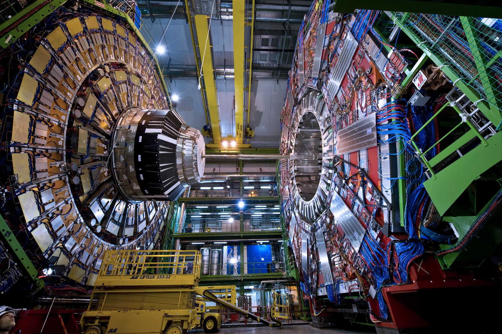

I’ve just finished “A Brief History Of Time” by Stephen Hawking and I feel my brain more efficient, bigger and smart just by reading this book. What an amazing journey Hawking takes you to; you’ll learn about the discoveries of Galileo, Newton, Einstein, Maxwell, Hubble, and so many other great scientist that have changed the way we see and understand the universe.

This is a book purely about psychics, almost. From well known theories like Newtonian gravity and the philosophy of Aristotle, to the mind-bending, crazily complex quantum theories, black holes and relativity. The whole purpose of the book is to explain where are in terms of finding the “complete theory of the universe”. This will combine all the main forces taking place in the universe into one unified theory, allowing us to predict and understand it.

But this jewel of a book doesn’t feel like a book purely about psychics. As the book’s title “Brief history of time”, this book is all about the history of science and human kind in the search for truth.

It is a crash course on the history of the universe, the way we think it started and how we think it could end. Humanity’s struggle to understand the universe, where we come from and **why the universe is the way it is have been haunting us from time in memorial.**

We used to think the universe was composed of our solar system, with the earth in its center and everything else spinning around us. Oh, we, mighty and important human beings.

But the more we learn and the more complex and mind blowing the theories get, the more our top researchers, thinkers and physicists realize how much more we have to discover.

We’ve come far as a specie. We are able to build giant, complex structures like the CERN or LIGO. Machines that most people don’t know exist, let alone understand. We create complex simulations of the universe in order to get closer to finally “understand the universe”.

Hawkin rarely discusses the findings or theories from his personal point of view but from the broader scientific angle. What a discovery meant for a theory, why one theory gained popularity while another was discarded. The book has so much detail you will end up being several magnitudes more literate on the matters of science after finishing it.

Moreover, he mentions God and the part “he” would play in all this mish-mash. The church approves of the Bing Bang — the theory that the universe started in a single, infinite point — as the scientific cause for the beginning of time. They do because due to the Bing Bang properties, you can blame God for creating it. Our theories simply break down at that point called singularity.

I really enjoy the fact that Hawkin includes God in a book about science and psychics, not because I’m highly christian but because I, personally, think of science as a way for us to understand the universe, and therefore “God”, whatever a God is depending on the many weird religions we have.

Or as Stephen Hawkin put it in the last paragraph of the book:

> However, if we do discover a complete theory, it should in time be understandable in broad principle by everyone, not just a few scientists. Then we shall all, philosophers, scientists, and just ordinary people, be able to take part in the discussion of the question of why it is that we an the universe exist. If we find the answer to that, it would be the ultimate triumph of human reason — for then we would know the mind of God.
