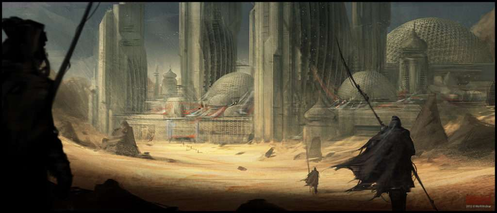
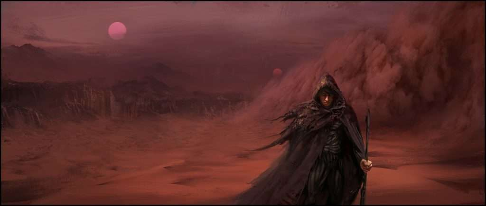
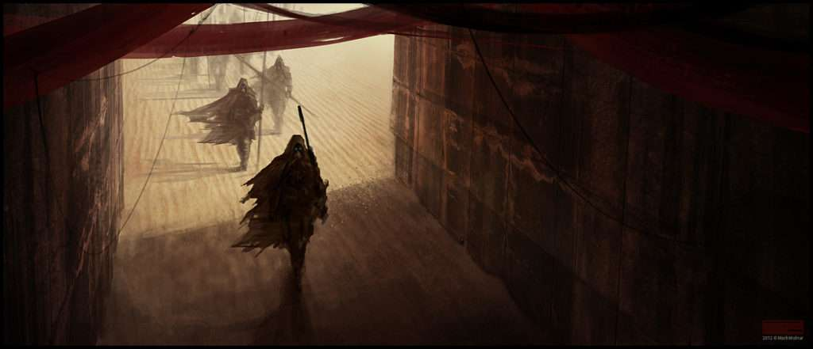
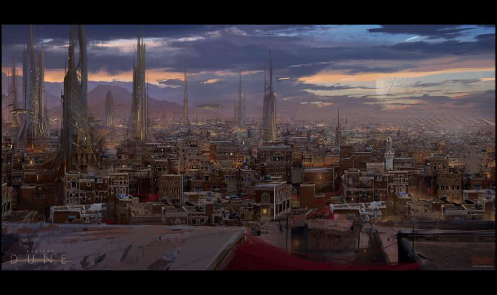

  

Frank Herbert is considered by many to be one of the best science fiction writers of all time. He wrote the classic, astounding and eye-opening Dune, the best selling sci-fi novel of all time, alongside 6 more Dune series books. Each one of them a masterpiece of storytelling, imagination and inter-connected stories.

[Dune is a masterpiece of storytelling](https://obedparla.com/books/reviews/last-dune-thoughts-chapterhouse-journey-reading-dune/), one of the main reasons it's the cleverness of its narrative, hidden meanings and an unexpected hero.

Imagine you want to write a story that stretches itself along five thousand years of a sci-fi future. How would you go about writing it, and yet make it all work out? When each new book has different characters, how to disconnect them enough so that each and every book has a different protagonist, hero and villain, yet all of them are somehow connected? How to change the setting of the story and society itself (since from book to books a hundred generations have passed), yet still make sense? Now try to answer all these questions while keeping true to the form, ambience and narrative of your universe.

It's an almost impossible feat without some trickery and mind-blowingly good writing skills. [Dune is, in fact, my favourite book,](https://obedparla.com/books/top-10-books-2016-taught/) and one of my [favourite series](https://obedparla.com/books/my-top-5-books-of-2018-with-short-reviews-and-highlights/). Long after reading them, I still find inspiration in them and wonder about unanswered questions.

## Legendary Storytelling: How To Keep The Reader's Sense Of Continuity For Thousands Of Years.

The answer hit me one day like a brick: Fran Herbert managed to do it by giving the reader a focal point, a horizon, something for the reader to feel familiar with while discovering brand new worlds. But what can remain the same during thousands of years of war, plotting and an ever-changing universe?

The answer's almost too simple: allow for the _real_ hero of your story to live through each book's millennia, make it so that each book's protagonist need your hero. Even more importantly, make sure he's never truly seen as what he really is: the thread that unites your literary universe! The reason _it all makes sense_.

Let's step back for a moment and try to see the depth of the Dune universe.

In "Dune" and "Dune Messiah" (book 1 and 2), the main character is Paul Atreides, a remarkable young man who's taught the art of war, the ballet of close-combat and the toughness of life. Paul goes on to become The Emperor of the human universe through skill, cleverness and a bit of luck. He then has twins, Ghanima Atreides and Leto Atreides II.

Leto II is the main character of "Children of Dune" and "God Emperor Of Dune" (books 3 and 4). Book 4 takes place 3.500 years after book 3. The protagonist of Heretics of Dune (book 5) is Miles Teg, a direct descendant of House Atreides (and therefore of Paul). This book takes place 1.500 years after book 4.

Finally, "Chapterhouse: Dune" (book 6) takes place only a few years after book 5, its protagonist is Darwi Odrade, an indirect descendant of, you guessed it, House Atreides.

Feeling confused? The six Dune books aren't a walk in the park, believe me. They're barely linear and each raises as many questions as it gives answers. Reading through them is an exercise on focus.

## Dune's Real Hero

How do you connect all these characters? They're all House Atreides descendants, but you can't keep bringing that up every second page. Well, you create the perfect character: **Duncan Idaho**.

Duncan Idaho is a stroke of genius by Frank Herbert. Duncan represents the best of human potential; an exemplary man that lived and died by his honor.

He was first introduced in Dune as Paul's master swordsman, as he was considered one of the best close-combat fighters ever to exist. Saved by Leto Atreides (Paul's father) from slavery and given a life of honour and purpose. Due to Leto's goodwill, Idaho felt forever indebted to the Atreides family. A debt that he's willing to pay off for thousands of years.

In order to keep some continuity during the books, Frank Herbert came up with the idea of Gholas, a clone that can retrieve their original memories by overly-stressing their senses (some weird futuristic genetics are involved). In each and every Dune book, you will find a Duncan Idaho doing his job, being the best of what Humanity could offer, and yet nowhere as powerful as the protagonists of each book.

All of Idaho's Gholas are overshadowed yet everpresent. A human with the best genetic makeup, backstory and motivations, a perfect individual that reminds all Atreides throughout history how what they should strive to be, and not, as in many cases, the Tyrants they become.

Duncan is honourable beyond hope. He dies a hero in book one while fighting several enemies to save Paul and Lady Jessica (Paul's mother) from assured death. It's later revealed that he wreaked havoc among dozens of enemies all by himself. Without Duncan, there wouldn't have been an Emperor Paul or a God Emperor Leto II. Without an Idaho, Leto II wouldn't have been able to improve humanity's genes to protect them from prescience (protecting them from being seen or found by others with the ability to see all).

In book 4 "God Emperor of Dune", Leto II (the God Emperor) kept resuscitating Duncan Idahos, one at a time, for thousands of years. No one ever explains why he was never without an Idaho companion. Why would the wisest, most powerful being in the universe bring back his father's old comrade and saviour?

Leto II was also a tyrant, slowly becoming an immortal but non-sentient being that would force all of humanity through starvation, misery and horrors, just to protect them from themselves. Idaho reminded him of his lost humanity, of what men should strive to be. And yet he kills hundreds of them when they turn against him.

## With Honour Comes Responsibility.

Idaho is a troubled man, with terrible and burdensome memories, living in different eras that don't welcome him and finding himself lost every new life. He's the presentation of what humans could become: good in nature yet ready to kill. Honourable, intelligent, skilful and wise but full of hatred for his oppressors and his family's murderers. Even after millennia, his heart wishes for revenge to those that did him harm. Duncan is more human than anyone else in Dune because he has the truest emotions.

Duncan Idaho is the connection Herbert needed to give a plot that spans 5 thousand years and 6 books a common denominator, an anchor and a continuity for the reader to latch on. You come to never question why Duncan is there, he's a given. Who wouldn't want to bring back the best fighter in history, loyal, honest, never to betray you?

Even when Duncan turns rogue and (Spoilers!) kills the God Emperor, he unleashes a new human era of freedom.

In Chapterhouse: dune, the last book in the series, Frank Herbert finally unleashes Duncan's full potential, allowing him to remember every single memory he ever had, for every single lifetime, all at once.

Finally, we see Duncan's worth, the curtain falls down and we're left with a wise, powerful man that nevertheless manages to retain his humanity. All men in the Dune series given such power so far have turned out to be or become, somewhat monsters, to be miserable and unable to escape their self-created peril. All except for our one true hero.

It might sound like Duncan Idaho is the obvious main character of the Dune series all along, but imagine you've been reading six books, all of which have intricate plot lines. They all have their protagonists, heroes and villains and Idaho is always portrayed as a secondary character. He never achieves anything as extraordinary as his contemporaries, he's even portrayed as trying to live a normal life multiple times.

Yet without him there wouldn't have been any plot line to follow through, he constantly enables all characters to pursue their glory. He enabled Frank Herbert to always come back to a known, reliable element the readers have come to trust in order to advance his ever-more-complex universe.

I said Duncan becomes a given, an unchanging element in one of the most complex world-building series ever made. That's where the true genius of Herberts shines brightest. It must be incredibly hard to keep bringing the same element to each widely different book while keeping it interesting but true to its nature. And Duncan is _always_ true to his nature, even as a warrior, father, counsellor or assassin.

It is incredibly sad that we never got to see Duncan's true, fullest potential, as Herbert died before finishing the last book of his masterpiece. What we know is that he had grand plans for our hero, as we see him heading off from book 6 with bells and whistles and up against yet the most intimidating villains we had ever seen in Dune, villains that have never lost yet lose a hand against Idaho's genius.

Duncan isn't a Harry Potter or a Katniss Everdeen, he's not Frodo Baggins or even Samwise Gamgee, he is and will forever be Duncan Idaho, servant of House Atreides, master swordsman, honourable and fearsome warrior.

* * *

Amazing fan art by [Mark Molnar](http://momarkmagic.blogspot.com/)
