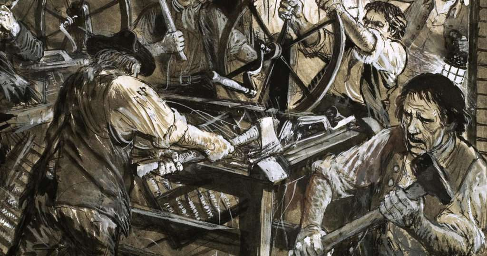
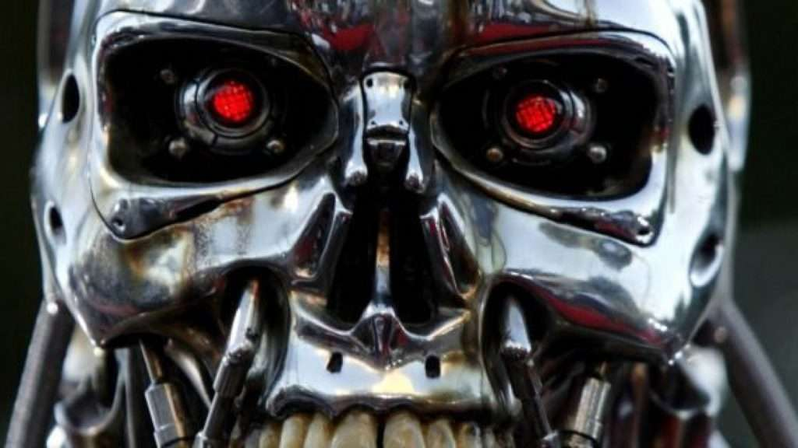

You might have heard of [The Three Laws of Robotics,](https://obedparla.com/books/thoughts-on-i-robot-by-isaac-asimov/) they were laws proposed by Isaac Asimov on his famous book "I, Robot". Such laws would dictate every decision taken by a robot, from crossing the street to saving someone's life.

When Asimov first revealed the laws to the world in 1942 the terms Artificial Intelligence, machine intelligence, or AI for short was barely a concept. It would take another 15 years before the field advanced enough for simple AIs to play checkers and prove simple mathematical theorems.

Later in the 80s, AI was "revived" and the field blossomed once more, leading to the famous Deep Blue IBM computer in the late 90s. Deep Blue would eventually beat the world's Chess champion and, turning AI into a hyped venture. But after Deep Blue, the world seemed to forget about AI for many years, until now.

In 21 lessons for the 21st Century, Yuval Noah Harari discusses the frightening possibility that in the near future, [algorithms will know and understand us better than we do ourselves](https://obedparla.com/books/highlights/best-quotes-21-lessons-21st-century/#3). Using the power of Big Data (the massive collection and processing of information by big companies and governments) together with AI, computers will have such a sophisticated understanding of the world, that their "guesses" at what individuals want will be astonishingly accurate.

Harari warns that this will lead to us trusting the machine more than we trust ourselves, and we don't have to go far to prove this is true. Whenever I wish to go somewhere new, I simply turn on Google Maps and trust its directions, even if I know it tends to take me through annoying shortcuts. During discussions at work, we use Google search as our source of truth. Whoever's opinion is backed by Google ultimately wins.

Algorithms are unbiased, or so we think, and having them on our side creates a barrier of "truth" that it's hard to climb.

## Intelligent Machines

Asimov envisioned a future with intelligent as well as conscious robots. Hyper-advanced AIs such as Google's Deep Mind have proven that [computers can beat humans at anything](https://www.newscientist.com/article/2132086-deepminds-ai-beats-worlds-best-go-player-in-latest-face-off/) without having a conscience, all you need are the right algorithms and machine learning techniques.

The laws of robotics as proposed by Asimov gave robots a moral compass, they always knew what to do based on such laws, but thinking that simple rules can guide behaviour indicates that the robots were capable of analysing situations the way a human would.

Indeed, the robots in Asimov's universe talk and even have philosophical debates with humans, up to the point in which an incredibly advanced robot turns out to be caring and nurturing humanity all throughout the universe, extending the Zeroth Law, to protect all of humanity.

> 1\. First Law – A robot may not injure a human being or, through inaction, allow a human being to come to harm.
> 
>   
> 2\. Second Law – A robot must obey the orders given it by human beings except where such orders would conflict with the First Law.
> 
>   
> 3\. Third Law – A robot must protect its own existence as long as such protection does not conflict with the First or Second Laws  
> Isaac Asimov’s Three Laws Of Robotics
> 
> [Isaac Asimov was an amazing, prolific writer.](https://obedparla.com/books/isaac-asimov-the-quintessential-writer/)

But in the 21st century, we're no closer to a conscious artificial intelligence than we ever were, and some say we will never see it. And why should we? Intelligence has been proven to be unrelated to consciousness. Computers can outperform humans in every field, even in what were once thought to be human-only fields such as the creative world.

Computers can now write songs, perform them, and analyze how we are incapable of differentiating between a human song writer and a machine.

In highly competitive chess tournaments, watchdogs have learnt to look out for highly "creative" moves, as they have become the landmark of good algorithms. AI has outpaced humanity in what was thought to be the hallmark of intellect. We're seeing AI creating news articles, videos, images, and even falsifying a real-time speech, making someone look like they're saying something they're not.

Perhaps it's time to start asking ourselves, should we hardwire some moral principles into our most powerful AIs? Should intelligent machines be reigned in by such laws as Asimov's? To protect humanity above all else?

## My new employee is amazing, it doesn't tire, eat, or complain.

"History repeats itself" is a common axiom used to discredit the future impact of machines taking out jobs, after all, the industrial revolution did exactly the same: a bunch of machines took over the jobs of millions of people, from tailoring and agriculture to pressing smashing bolts into a car.

The big difference is that machines back then were _stupid. _We're dealing with smarter-than-your-dad computers now! They literally have the potential to do anything you can do but better, faster and cheaper. And something history has proven is that no matter how unhappy it makes people to lose their jobs, [economics always wins.](https://www.history.com/news/industrial-revolution-luddites-workers)

Luddites was a movement of people opposing new tech during the industrial revolution. They lost.

We're reaching a point in which important decisions are being taken by algorithms rather than humans. Who's deciding wether to give you a loan at the bank, approve your visa, extend your credit, or what you're gonna read or watch next? Certainly not a human.

Netflix, Spotify and Youtube all show you new content based on algorithms that match your profile to thousands of others and figure out what you're likely to click on next. Google decides what website to show first when you search both for "how to make cake" and "should I commit suicide?". The result to the first is irrelevant, the result to the second might change someone's life.

Who would you rather have counselling a distressed teenager, an algorithm created to make money, or a human that can literally cry alongside you? The answer is simple.

## Humans are biased, therefore algorithms are biased too

Don't get me wrong, I'm a technologist. I believe technology's potential to improve _everyone's_ life. The problem is that we, as a society, are not making sure these powerful algorithms and corporations are helping everyone and not just a few of us.

Machine learning is basically an algorithm with rules that is given a goal, and a lot, and I mean _a lot_ of data. We're talking about Google's worth of data, in order to learn and reach that goal.

But humans are biased. We tend to prefer people similar to us and to discriminate those who are different. Minorities have always been subject to abuse, and at the very least, irrelevancy.

So when an algorithm aimed at figuring out wether you're eligible for a house loan scans the bank's database in order to figure that out, some piece of code that no one really understand sees you're part of a minority and that you had an issue with police 10 years ago, it decides to decline the loan. Why? You ask. No one knows, the Master Computer said no, and no it is.

But that one time at the police station was someone else's fault. You're a successful woman working in tech, with colleagues that look up to you as a role model. Should the computer care? Absolutely, and it would if that piece of code wasn't there, but then again, no one really coded it, it just grew and created itself from data that we, biased humans, have collected.

> The fruit never falls far from the tree

## Morality is far too complex

We're able to make computers that beat the best of us at chess, Go, or almost anything else. But we haven't found a way to instill morale onto our creations.

Morality is simply far too complex for our algorithms to have right now. In order for a computer to know what's "the right thing to do" we need to make them conscious, having full-blown artificial intelligence, and that comes with a whole new set of problems!

Skynet is watching  
  

So maybe we can't simply use Isaac Asimov's Three Laws Of Robotics, but we should be smart enough to create legislation and economic incentives that help _everyone_ be benefitted by our future silicon overlords.

The stakes are simply too hight for us to give it up to chance and hope the people in Silicon Valley make all the right choices.
